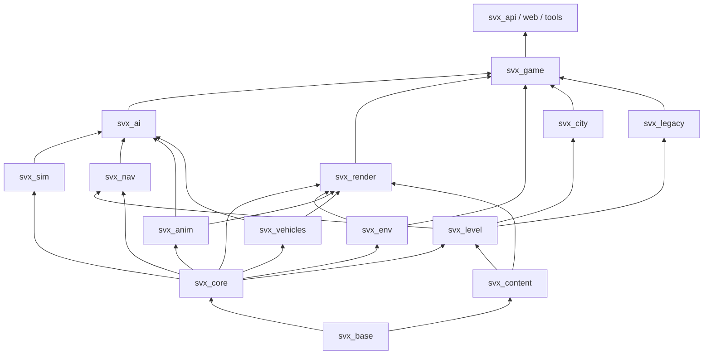

# Merging voxel_city into structvox, and the engine's module structure

**Design and execution plan.** Written 2026-10-01 on branch `merge_procgen_1` (`0eda3ca`, identical
to `main`) against `voxel_city` `main` at `4ed8e16`. It is meant to be handed to an agent with no
other context: read it whole before changing anything.

---

## 0. Read this first (for the executing agent)

**What you are doing.** Replacing the game harness's procedural generation with a C++ port of the
much richer `voxel_city` generator, making its city fully physical (destructible structure, loose
props that are rigid bodies, burnable vegetation, real materials), populated (traffic on its roads,
pedestrians on its sidewalks), and the default world of the game. Then restructuring the repository
into cleanly separated modules (§12). Future AI and simulation modules are designed for, not built
(§13).

**Documents to read, in order.**

1. This document.
2. `README.md`, then `docs/CORE.md` (the physics core as a library: concepts, streaming, memory,
   extension points, determinism, known limits, the cost/quality knobs).
3. `docs/GRIDS.md` (oriented grids), `docs/MOTION.md` (joints, articulations, wheels),
   `docs/DAMAGE.md`, `docs/ENV.md` (fire, smoke, water), `docs/ANIM.md` (characters),
   `docs/VEHICLES.md`, `docs/API.md` (worker protocol), `docs/BASELINE.md` (the behavioural
   baseline and CI gates).
4. In the `voxel_city` repository: `README.md`, `docs/ARCHITECTURE.md` (generation hierarchy,
   determinism rules, every subsystem), `docs/MERGE_SVX.md` (the export layer written for this
   merge), `ANGLED_WORLD_PLAN.md` (oriented parts and their physics budget).

**Ignore as stale:** `cursor_engine_review_and_audit.md` and `goal.md` in the repository root. They
are an earlier audit and prompt from before the animation port, the `World::Impl` split and the
baseline work; several of their claims (for example "euphoria_3 not started") are no longer true.

**Ground rules that every change must keep** (they are what makes this engine trustworthy):

- **Determinism.** Same world, configuration and commands at the same ticks give bit-identical
  results on any thread count, natively and in WASM, on ARM and x86. No wall-clock time in
  simulation decisions, no unordered iteration feeding results, no platform `libm` transcendental
  functions on simulation or generation paths (use `svx/base/dmath.hpp`, or bit-exact ports of the
  algorithms named in §7.4), `-ffp-contract=off`, no fast-math.
- **No exceptions, no RTTI** in libraries. Callbacks into the core must not throw.
- **Code only reaches down, through public headers** (`docs/CORE.md` §1). The core knows nothing of
  cities, cars or people. Every core addition in this plan is generic (§8).
- **Every behaviour change to existing mechanics is a switch** (a world tunable) so the legacy
  baseline stays reproducible (`docs/BASELINE.md`). New mechanisms must do nothing where unused.
- **Memory is bounded by construction** (`docs/CORE.md` §4). New caches (the generator's included)
  have budgets and report their bytes.
- **CI stays green at every commit**: `ctest` (core, env, anim, game suites), the golden hashes
  (`tools/baseline/golden.sh`), the soak (`svx_soak --check`), the environment perf gate, the WASM
  build and its tests, the web typecheck and tests, and the browser checks (nightly / `[browser]`).
  The legacy worlds' golden hashes must not change unless a step says so explicitly.
- **Match the repository's style**: commit subjects `Area: what changed`, docs updated in the same
  commit as behaviour, tests next to the module they test.

---

## 1. Summary

**Verdict: feasible, and the right direction.** The two codebases were already designed to meet:
`voxel_city` contains a structvox export layer (`src/engine/svx/`) that speaks the core's
`ChunkSource` / `GameSource` / `RoadNetwork` contracts call for call, and its native harness passes
on this branch today (§3.3). What remains is (a) a C++ port of about 36,000 lines of generator
JavaScript, (b) five generic core additions without which a city this rich cannot stream or behave
physically, (c) integration into the game harness, renderer and presets, and (d) the module
restructuring.

**Recommended path.**

1. **Port the generator to C++** (§7), faithfully, verified stage by stage against the JavaScript
   reference pinned at `4ed8e16`. Running the JavaScript beside the engine was considered and
   rejected: the engine's whole verification stack (native tests, golden hashes, soak, replays,
   benches) would never see the new world, and at driving speed the JavaScript costs about one core
   just to keep up (§3.4).
2. **In parallel, add the core features** (§8) and validate them on baked districts dumped from the
   JavaScript reference, so physics work does not wait for the port.
3. **Integrate** (§10): presets, props as loose rigid bodies, burnable vegetation, appearance
   palette, traffic and pedestrians on the new roads, water, far tier.
4. **Then restructure** into the modules of §6 (§12), step by step, each step behaviour-preserving.

**Key findings** (with evidence in §3.4):

- **Props as the export proposes would disintegrate.** `voxel_city`'s merge guide says to write
  furniture and street props with `kEditIsolated`. That flag tears *every* face of every written
  voxel, so a bench becomes 192 unbonded voxels; one small shot turned all of them to dust in a test.
  It also marks lamp posts, signals, hydrants, tanks and gantry cranes as "isolated", which would make
  them fall over. Props need a new generic primitive: **seams** (unbonded faces supplied by the
  source), with which a prop stays in the grid at zero cost until disturbed and then becomes one rigid
  piece (verified with a stand-in: 190 of 192 voxels came off as one piece; a falling block also
  promotes it).
- **Streaming a world with relief does not work yet.** The core generates every chunk of a column
  from the extent's bottom to its top (at most 1,024 chunks, about 4 km). `voxel_city` reports
  1,850 chunks of height (600 m below sea level to 800 m above 6 km peaks), while a column's real
  content averages 2–4 chunks (maximum 7). Without **per-column content ranges** the streamer would
  ask the generator for some 400 times more chunks than needed (keeping a record of every rock chunk
  below the surface), and cut off mountains above about 3.5 km.
- **Vegetation needs a non-structural material.** Leaves, grass and crops must neither be structure
  (millions of fragments) nor supports (grass would hold up walls). The export works around it by
  making them air in a layer, which means they cannot burn, bullets pass through them and a felled
  tree leaves its crown hanging in the air. A **decorative** material flag solves all three.
- **Appearance does not fit today's renderer or memory.** The city has 400 looks (454 material/look
  pairs, 9 transparent, 24 emissive); the renderer's palette has 64 entries. Storing a look byte per
  voxel as a layer would double resident grid memory (about 35 KB per mixed chunk today). Looks
  should be **regenerable from the source** rather than stored (§8.4).
- **First touch of a building is an existing hitch, not a new one.** Shooting or blasting a building
  for the first time costs 90–240 ms in one tick natively at 4 threads, the same order for the drive
  city and for `voxel_city` districts (structure size is capped at 60,000 nodes either way). It is
  worse in WASM. A switchable background "pre-touch" (§8.5) removes it.
- **The module list is close, with three changes** (§5): rendering is two halves (C++ render
  preparation in the worker and the TypeScript renderer); "AI" should split into navigation and
  agents; "entity management" is a domain-agnostic simulation framework, distinct from game rules.
  Three modules are missing: a **content registry** (materials with physics, fire and appearance
  facets; prefabs), **vehicles** as an actor library beside animation, and **world semantics**
  exported by the level module (buildings, rooms, entrances, furniture affordances) without which
  daily routines cannot exist later.

**Size and effort.** The animation port in this repository (about 22,700 lines of TypeScript to
14,500 lines of C++, tests included) landed within roughly a day of commits. The generator port is
about 1.6 times larger and holds itself to stage-by-stage conformance, so expect several times that:
on the order of one to two weeks of agent sessions for the port, about one week for the core
additions, one to two weeks for integration and hardening, and about one week for the module
restructuring. Treat these as relative sizes, not promises; the long pole is conformance debugging
(§7.4), not typing.

---

## 2. Goals and non-goals

**Goals of this branch** (in the user's words, condensed):

- The generic physics core (destruction, structural integrity, rigid bodies, joints, wheels,
  articulations, streaming, persistence) stays domain-agnostic and is matured by this real use case.
- `voxel_city`'s generator becomes the default driver of the game harness: its city fully
  physical (every building, road, bridge and tree destructible with structural integrity), every
  material with proper properties (burns if combustible), props and furniture as independent rigid
  bodies that can be pushed and broken, cars driving its roads, pedestrians walking its sidewalks.
- The generator may be rewritten in C++, and should stay easy to extend with assets, systems and
  presets. Presets include the existing demo worlds and levels, and bounded worlds (a finite island
  in an endless sea) as well as infinite ones.
- Rendering stays decoupled; it will be iterated on separately later. The animation system stays
  decoupled from rendering.
- After the merge, the repository is restructured so that each module can be iterated on
  independently.

**Non-goals now:** authoring game content (missions, story), new rendering features beyond what the
new world needs to be visible (§10.7), the AI and simulation modules themselves (designed in §13,
not built), planets and wrapping worlds (§10.1 lists what runs).

---

## 3. Where things stand

### 3.1 structvox on `merge_procgen_1`

| Module (CMake target) | Lines | Role | Depends on |
|---|---|---|---|
| `core/` (`svx_core`) | 25,400 | physics: grids, materials, fragments, stress (multigrid PCG), rigid pieces, joints, wheels, articulations, streaming, change archive, persistence, queries, C API | C++ std only |
| `mesh/` (`svx_mesh`) | 550 | greedy chunk, piece, coarse and water meshing | core |
| `env/` (`svx_env`) | 2,700 | fire, smoke, water on the core's extension points | core |
| `anim/` (`svx_anim`) | 14,500 | characters: voxel models, motion plan, body (deep = core articulation, shallow = own XPBD), behaviours, `CharacterSystem`, gibs | core |
| `game/` (`svx_game`) | 9,600 | `Game`: viewer, movers, triggers, command log, render output (meshes, far tier, water, charring), vehicles, traffic, pedestrians, game materials and paint, Doom WAD import | core, mesh, env, anim |
| `procgen/` (`svx_procgen`) | 1,900 | test levels, 1 km streamed city, endless drive city | **game** |
| `game/api` (`svx_api`) | 900 | the worker's C ABI; picks levels | game, procgen |
| `web/` | 14,100 (+2,400 mock engine) | TypeScript: worker host, protocol, WebGPU renderer, game client (player, weapons, driving, HUD) | the C ABI |
| `tests/` | 16,400 | doctest suites per module; `tools/` benches, soak, replay, baseline | |

What is already good and must be preserved: the core's public API is `World` alone with its
implementation behind `World::Impl` split by subsystem; extension points (layers, damage, loads,
piece forces, systems) carry the environment and the characters; determinism is tested across
threads and against WASM; every lossy optimization is a tunable; the baseline reproduces the
structural reference bit for bit with the switches off; memory is budgeted per kind.

Couplings to fix in the restructuring (§12): `svx_procgen` depends on `svx_game` (for `Level`,
`GameSource`, `RoadNetwork`, the game's materials and `Paint`); `Game` owns render preparation,
vehicles, traffic and pedestrians as well as game rules; the Doom importer lives in the game; the
renderer's palette is hard-coded in TypeScript; a TypeScript mock engine duplicates the core for
renderer work without WASM.

### 3.2 voxel_city at `4ed8e16`

A JavaScript (ES modules, no DOM in the engine) procedural world generator at 12.5 cm voxels, the
same voxel size and 32³ chunks as structvox: about 36,200 lines of engine code in about 120 files,
a 3,800-line three.js/React viewer, 34 test suites (5,700 lines) and a golden conformance record.
It generates cities with full interiors (every room reachable through doors and stairs), elevated
highways with ramps, subways, sewers, bridges, rivers, lakes, caves, terrain with 6 km mountains,
climate biomes and forests of modelled trees, seasons, islands in an endless sea, sites (military
bases, research complexes, mountain strongholds) and an "angled world" of exact rational rotations
(turned buildings, wings, bays, pitched streets) whose parts become oriented grids in structvox.

Its architecture (`docs/ARCHITECTURE.md`) suits a port: everything is a pure function of
`(config, structural key)`, seeded per entity (`Rng.from(seed, id, purpose)`), planned
semantically (roads, lots, envelopes, floor plans) and voxelized last by one chunk composer of
ordered feature sources, with lazy LRU caches and registries for extension (districts, archetypes,
styles, sites, landforms, biomes, flavors, presets, feature sources).

Its `src/engine/svx/` export maps the 400 city materials onto 24 physics classes (the core's
presets and the game's materials at their ids, plus six of its own registered from id 21: roofing,
partition, soft, ice, snow, foliage), carries the look in a solid-bound `look` layer, plants in an
air-bound `flora` layer, liquids in the `water` layer, parts as `SourceGrid`s, regions as city
blocks, roads as a `RoadNetwork` (lanes, turns, signals, walkways, parking, highways and ramps), and
props and furniture as "isolated" voxels.

### 3.3 What already interoperates

`voxel_city/scripts/svx-harness/harness.cpp` serves a dumped district through a `ChunkSource`,
registers the game's materials then the city's, streams, ticks and checks. Built against this
branch it passes on both districts tried: the materials get the ids the export expects, every part
is a grid at its exported frame, the district stands under its own weight (design pass on first
touch), and every lane point checked lies on a road surface (97 of 97, 72 of 72).

### 3.4 Measurements

All on this Mac, native Release build of `0eda3ca`, 4 threads unless noted. Reproduction in §16.1.

**Generator cost (JavaScript, single thread, Node 25)** through the export, a 64 m × 64 m patch
at the spawn, every chunk from −32 m to +160 m:

| Preset | ms per chunk (all) | ms per non-empty chunk | prop/furniture voxels in the patch |
|---|---|---|---|
| `infiniteCity` | 0.57 | 1.12 | 53,000 |
| `angledInfiniteCity` | 0.64 | 1.21 | 177,000 |

At 30 m/s a 192 m wide band of new columns needs on the order of 1,000 mixed chunks a second, which
is about one JavaScript core doing nothing else. The drive city's C++ generator, for comparison,
filled 3,130 mixed chunks in under 100 ms on 4 threads (its buildings are shells).

The prop counts (thousands of objects per 64 m patch) rule out spawning every prop as a rigid
piece: the core's piece budget is 3,000 (`max_bodies`).

**Column heights.** The export reports a vertical extent of 1,850 chunks; the core caps it at 1,024
and generates every chunk of a column bottom-up. Real content per column, 16 × 16 columns:

| Preset, place | mean chunks with content | max |
|---|---|---|
| `infiniteCity`, spawn | 2.3 | 7 |
| `nordicIsland`, spawn | 3.9 | 6 |
| `cities`, out of town | 1.7 | 6 |

**First touch** (the first shot or blast at a building in a streamed world: its structure is
walked, its multigrid built, and it is designed in the same tick):

| | drive city (64 m radius) | `voxel_city` downtown (84 m square) | `voxel_city` angled harbour (84 m square) |
|---|---|---|---|
| resident mixed chunks | 3,130 | 580 | 795 |
| grid memory | 108 MB | 26.5 MB | 37.5 MB |
| first shot: tick | 235 ms | 122 ms | 88 ms |
| first blast (1.2 m, 400 kJ): tick | 239 ms | 122 ms | 91 ms |
| nodes extracted | 60,000 (the cap) | 60,000 (the cap) | 35,945 |
| voxels strengthened by the design | 570,000 | 174,000–195,000 | 231,000 |

The dumps leave out props and plants, and these two districts are not the densest the generator
makes; measure downtown towers again once the port runs. Grid memory is about 35 KB per mixed chunk
(32 KB of voxels plus overlays) before any look layer.

**Props.** A 12 × 4 × 4 wooden bench written with `kEditIsolated` on an anchored floor: the bond
between two of its voxels is broken immediately; one 0.1 m, 50 J shot turned all 192 voxels to dust
(24 dust events, no piece). The same bench generated by a streamed source one voxel above the floor
(a stand-in for an unbonded seam): no piece at rest; after the same shot, one piece of 190 voxels;
with a concrete block dropped on it instead, the bench came off as its own piece.

---

## 4. Gaps the merge exposes

Generic core gaps (designs in §8):

1. **Per-column content ranges** in streaming: generate only the chunks of a column that hold
   content; treat what is below as implicit solid support and what is above as air.
2. **Seams**: faces a source declares unbonded, so an object can sit on a floor without being part of
   its structure. With them, resting objects are free at rest and promoted to pieces by what touches
   them; a few triggers are missing (player and character pushes, an explicit `loosen`), and the
   bounded-level design pass must keep resting objects instead of deleting them as floating.
3. **Decorative materials**: solid for rendering, rays, collision (optionally passable) and fire, but
   never fragments, bonds or supports; carried with or shed by what they grow on.
4. **Appearance without per-voxel storage**: base layer values regenerated from the source on
   demand, only changes stored; and uniform-valued layer chunks (a lake, the sea) stored as one value.
5. **Background first touch** (pre-touch): design and register structures near the focus ahead of
   time within a work budget.

Smaller core items: sparse storage of broken faces (seams make broken faces common; today a chunk
with one broken face allocates 32 KB), `ChunkSource::memory_bytes()` so a generator's caches appear
in `World::memory()` and the soak, and raising `kMaxLayers` from 8 if needed (5 are in use: damage,
paint, heat, burn, water).

Level and game gaps: a preset system (today `svx_load_procedural` switches on hard-coded names);
props classified by how they attach (fixed, loose, entity spawn, decorative) instead of all
"isolated"; special vehicles at stations as spawn records; a semantic query interface for buildings
and places; streaming configuration per world; an ocean policy beyond an island's extent.

Render gaps: the palette (64 entries in a uniform) must become a table of at least 1,024 appearances
supplied by content; glass needs transparency and lamps emission; the far tier must show water.

---

## 5. Review of the proposed module structure

The user's list: core physics and streaming; core animation; core rendering; core level
(procedural generation and preset worlds); later core AI (NPCs, cars, combat, pathfinding, routines)
and core entity management (game logic).

**Physics and streaming core — agree.** Keep streaming in the core: chunk residency, the change
archive and piece and articulation archiving are entangled with the physics state and must stay one
deterministic system. Two refinements: extract the foundation utilities (`svx/base`: types, vectors,
deterministic math, parallel pool, memory accounting, hashing) into a `svx_base` target so that
modules which need math but not physics (the generator, navigation, render preparation) do not link
the physics; and keep `svx_env` (fire, smoke, water) as a separate optional module on the core's
extension points, as it is today.

**Animation — agree, with a sharper boundary.** `svx_anim` is already the right module: it is
coupled to the core (articulations) and not to rendering (it emits meshes in a documented vertex
format). Define its boundary as *motor control without decisions*: it takes intents (go there at
this pace, face this, sit at this seat, strike, brace) and produces bodies that obey physics.
Choosing those intents is AI. Today the pedestrians' "minds" sit in `svx_game` (`pedestrians.cpp`),
which is correct in spirit; they move to the AI module later. The animation module's own furniture
models (bench, chair, desk to sit at) should eventually become *affordances on world props* rather
than separate models (§10.8).

**Rendering — agree, but it is two halves.** Half of rendering runs in C++ inside the worker:
meshing, deciding what to remesh (charring, glow, water), the far tier, piece meshes and poses,
character meshes and skins. Today all of that lives in `Game`. The other half is the TypeScript
WebGPU renderer, entangled in `web/` with the game client. Make a C++ `svx_render` module (render
preparation, absorbing `svx_mesh`) that observes the world, environment and actors and emits a
**scene stream**, and a TypeScript renderer that consumes only that stream. The renderer can then be
iterated on alone by replaying recorded scene streams, which also retires the 2,400-line TypeScript
mock engine.

**Level — agree, split framework from generators.** "Procedural generation plus presets" is two
things: a domain-agnostic *level framework* (the world source interface, presets as data, bounded
level files, importers such as the Doom WAD voxelizer, world modes such as infinite or island in an
endless sea, the generator toolkit: deterministic noise, rotations, chunk writer, concurrent caches)
and *generators* that are content (the city, the legacy drive city and test levels). The framework
is core; each generator is a plugin authored on it. The level module must also export **semantics**
(roads, walkways, buildings, rooms, entrances, places, furniture affordances, zones, spawn records),
which navigation, AI and gameplay need and which `voxel_city` already computes.

**AI — split into navigation and agents.** Pathfinding is used by vehicles, pedestrians, combat,
the player's tools and routines alike, and it is tied to the level's semantic graphs and to the
world's changing geometry (destruction opens and blocks paths). Make **`svx_nav`** (lane graph, walk
graph, indoor room/door/stair graphs from level semantics; dynamic voxel-based local navigation;
planning; crowd and traffic avoidance) and **`svx_ai`** (perception, memory, decisions, level of
detail scheduling from full simulation near the player to statistical simulation far away,
population managers, schedules and routines, combat tactics primitives). Authored behaviours
(pedestrian personalities, drivers, police) are content on top of `svx_ai`.

**Entity management — rename it and keep game rules out.** What manages *what exists* is a
domain-agnostic **simulation framework** (`svx_sim`): entity identity and components, lifecycle tied
to streaming regions (archived and forgotten with them through the core's archive), persistence, the
tick pipeline and its phases, the command log for replays and lockstep (today `game/replay`), and an
event bus. *Game logic* (weapons, damage to the player, wanted levels, missions) is the game, built
on it. Keeping the two apart is what lets the same engine host a GTA-like, an RTS or a life
simulator.

**Missing modules.**

- **Content (`svx_content`)**: one registry of materials with facets per consumer (physics into the
  core's tables, combustion and heat into fire, appearance into rendering, later sound and gameplay
  tags), stable ids pinned in data (saved sessions depend on them), prefabs (voxel models of props
  with how they attach and what they afford). Today materials are split across the core's presets,
  `game/materials.cpp`, `FireSystem` defaults, `set_game_fire_materials`, the `Paint` enum and a
  palette hard-coded in `renderer.ts`.
- **Vehicles (`svx_vehicles`)**: vehicle models (voxel assemblies on the core's wheels and joints),
  drivetrain and controls, damage read-out. It is the twin of animation: an actor library that takes
  inputs and obeys physics. Traffic, which decides those inputs, is AI.
- **World semantics** (inside the level module, §10.8) and later a **life simulation** layer inside
  AI (time of day, calendar, population: who lives and works where, needs, schedules), which requires
  the semantics.

---

## 6. Target architecture

### 6.1 Layers and modules

```
L0  foundation   svx_base        types, vectors, quaternions, deterministic math, hashing and RNG,
                                 parallel pool, memory accounting, binary serialization, diagnostics
L1  kernel       svx_core        physics, streaming, archive, persistence, queries, extension points
                 svx_env         fire, smoke, water (world physics extensions)
L2  actors       svx_anim        humanoid characters: models, motion, bodies, motor behaviours
                 svx_vehicles    vehicle models, drivetrains, controls, damage read-out
L2  world        svx_content     materials (facets), appearances, prefabs, stable ids; data files
                 svx_level       world source interface, semantics interface, presets, world modes,
                                 bounded levels, importers (Doom WAD), generator toolkit
                 svx_city        the city generator (the voxel_city port): a WorldSource plugin
                 svx_legacy      drive city, 1 km city, test levels: WorldSource plugins
L3  simulation   svx_sim         entities, components, lifecycle with streaming, persistence,
                                 tick phases, command log and replay, events
                 svx_nav         navigation graphs, dynamic local navigation, planning, avoidance
                 svx_ai          perception, decisions, LOD scheduling, populations, routines
L4  presentation svx_render      render preparation (meshing, appearance, far field), scene stream
                 web/render      WebGPU renderer consuming the scene stream
L5  application  svx_game        the GTA-style demo: player, weapons, rules, its behaviours
                 svx_api, web/app, web/client, tools/
```



(Arrows point from a module to the modules that use it.)

### 6.2 Dependency rules

- A module depends only on modules in lower layers, and on siblings only where the diagram shows it.
  CMake `target_link_libraries` encodes the graph; a CI script checks that no source includes a
  header of a module it does not link (§12, step R9).
- `svx_core` keeps depending on the standard library only (and `svx_base`).
- Generators (`svx_city`, `svx_legacy`) depend on `svx_level` and `svx_content`, never on the game.
- `svx_render` reads the world, environment and actors; nothing below it knows it exists.
- `svx_game` is the only module that knows it is a GTA-like.

### 6.3 Contracts between modules

- **World source** (level ↔ core): `ChunkSource` as today plus the additions of §8 (column ranges,
  seams, regenerable layer values, memory reporting); `WorldSource` on top of it (replacing
  `GameSource`): spawn points, far-field view (`coarse` and later a heightfield for the horizon),
  semantics (§10.8), atmosphere for the renderer (sky, fog, sun, season), streaming configuration.
- **Content** (content ↔ everyone): materials by stable id and name with facets (`Material` for the
  core, `FireMaterial` for fire, an appearance record for rendering); appearance table
  `(material id, look byte) → appearance index`; prefab records.
- **Scene stream** (render ↔ renderer): the render-relevant subset of today's worker protocol
  (`docs/API.md`): chunk and grid meshes, grid frames, piece meshes and poses, character meshes,
  palettes and skins, wheels, particles from events, fire, smoke, water, far tiles, the appearance
  table, atmosphere. Versioned, recordable, replayable.
- **Navigation data** (level ↔ nav): `RoadNetwork` (lanes, turns, signals, parking) and walkways as
  today, plus indoor graphs later.
- **Actor control** (ai ↔ actors): character intents (`svx_anim` root and inputs, as `Pedestrians`
  sets them today) and `VehicleInput`.
- **Entity persistence** (sim ↔ core): entities bound to regions archive their records with the
  region and are forgotten with it. The core already archives pieces and articulations with host
  data; a small generic addition (host records attached to a region, `WorldSystem` callbacks when a
  region is archived, restored or forgotten) lets the simulation framework use the same bounded
  archive.

### 6.4 Invariants every module keeps

Deterministic (as §0), bounded memory with a `memory_bytes()` that the soak can check, its own test
suite linking only what it depends on, its own document in `docs/`, no exceptions across module
boundaries, configuration through tunables or data files (never ad-hoc globals), and its work
budgeted per tick in work units, never wall-clock time.

### 6.5 Tick pipeline and threading

One simulation thread owns the `World` and calls everything in a fixed order; parallelism is inside
phases on the core's deterministic pool:

1. Inputs (commands, logged) → `svx_sim` applies them.
2. AI decisions (parallel per agent, deterministic order of effects) → intents.
3. Actor controllers (`svx_anim` begin, `svx_vehicles` controls) → `WorldSystem::pre_step`.
4. `World::tick()` (structures, pieces, joints, wheels, articulations, streaming; generator calls in
   parallel inside streaming; systems' `step`: fire, smoke, water, characters' end).
5. Post-tick: entity registry from the world's events, perception updates, population managers.
6. `svx_render` builds the scene delta (meshing in parallel) for the host.

---

## 7. The generator port

### 7.1 Decision: port to C++

Considered alternatives:

- **The JavaScript beside the engine** (a browser worker pushing chunks into a `PushedSource`, as
  `docs/MERGE_SVX.md` §9B describes). Fastest to a first picture, but: the native tests, golden
  hashes, soak, replay and benches would never run the new world; at driving speed it needs about a
  dedicated core; the engine's streamer would need a "not yet" answer and a cross-thread chunk
  protocol; AI and gameplay would query semantics across a worker boundary. Rejected as the
  destination. Its cheap cousin, baked districts dumped from the JavaScript (`dump.js`), is used as a
  testbed in phase 1 (§11).
- **Embedding a JavaScript interpreter** (QuickJS): 20–50 times slower than V8's JIT. Rejected.
- **Automatic transpiling**: unreliable for this code's numeric semantics. Rejected.

The port runs wherever the engine runs, natively and in WASM, multi-threaded inside
`ChunkSource::generate`, and exposes semantics in-process.

### 7.2 Scope

Port all of `voxel_city/src/engine/` except the stream worker, the viewer meshers and anything that
only the viewer uses:

| Port | Directory | Notes |
|---|---|---|
| yes | `core/` | hashing (murmur finalizer, FNV-1a, `deriveSeed`), `Rng` (sfc32), 3D/4D simplex noise, `placement` (Pythagorean rotations), `geom2d`, `rect`, `obb`, units; `lru` becomes a concurrent cache (§7.5) |
| yes | `config/` | defaults, `makeConfig` (layered, idempotent), presets: as JSON data where possible (§10.1) |
| yes | `world/` | `World`, `createWorld`, fields, charts (flat; torus and cube as data paths, §10.1), wrap, island, landmarks, season, sites, parts, part rasterizer, registry |
| yes | `terrain/`, `nature/`, `network/`, `city/`, `buildings/` (with `interior/`), `underground/`, `sites/` | the generation proper |
| yes | `voxel/` | chunk writer (padded 34³, u16 city materials, LOD point sampling), materials (400), `compose` (ground tiles, feature sources, `buildChunk`, `groundChunk`) |
| yes | `svx/` | the export: classes and looks, source, roads, highway lanes; rewritten as the C++ `WorldSource` adapter with the changes of §7.3 |
| test-only | `validate/` | walkability, fit, angle-budget audits: ported as tests and tools, not shipped in the runtime |
| no | `stream/worker.js`, `stream/queries.js` | the viewer's job pool and queries (map, overview, inspector); port only the pieces the far field or tools need, later |
| no | `voxel/mesher.js`, `voxel/smoothMeshers.js`, `voxel/meshers.js` | the viewer's meshers; the smooth meshers are ideas for the later render pass |
| no | `src/viewer/`, `src/main.jsx` | the viewer (stays useful for looking at the reference) |

Keep the reference repository reproducible: add it as a git submodule at `reference/voxel_city`
pinned to `4ed8e16` (or vendor a snapshot if submodules are unwanted). Its own tests and
`node scripts/golden.js --check` must pass in that checkout before conformance work starts.

### 7.3 What changes during the port (deliberately not literal)

Port the planning and voxel generation literally. Change only the export, so that conformance stays
checkable on the generator itself:

- **Props by attachment** instead of "everything isolated" (§10.2): each prefab gets an attachment
  class (fixed, loose, entity spawn, decorative); loose objects get seams; fixed ones are structure
  bonded to the ground; entity spawns become spawn records, not voxels.
- **Plants as a decorative material class** (§8.3) instead of an air-bound `flora` layer.
- **Looks as regenerable values** (§8.4) instead of a stored `look` layer.
- **Column content ranges** (§8.1) answered from the ground tile's content range.
- **Semantic queries** (§10.8) on top of the plans.
- **Thread safety and memory bounds** (§7.5).

Everything else (ids, seeds, decisions, voxels) must match the reference.

### 7.4 Method

**Order** (each stage conformance-checked before the next): `core` → `config` → `world/fields`,
`chart`, `wrap`, `island`, `season` → `terrain` → `nature` (biomes, land cover, rivers, lakes,
caves, trees, forest, boulders, ground cover, farmland) → `network` (arterials, road classes, road
surface, road view, road levels, road parts, highways) → `city` (cell network, streets, districts,
flavors, lots, cell plan, polygon blocks, diagonals, grading, landscape, parks, industry, dressing,
prop prefabs, skybridges, town plan) → `buildings` (archetypes, styles, massing, facades, frames,
wings, chamfers, garage ramps, civic) → `buildings/interior` → `underground` → `sites` → `voxel`
(materials, chunk writer, compose) → `world/parts`, `partRaster` → `svx` export → roads export.

**Conformance tooling.** Add `tools/procgen_ref/` with Node scripts that run against
`reference/voxel_city` and write canonical little-endian binary records per stage (strings
length-prefixed, records sorted by id): field samples on a grid, cell networks (roads, blocks),
cell plans (lots, envelopes, spaces, parts), building plans (floor grids, doors, stairs, furniture
placements), ground tiles, chunks at LOD 0, 2, 5 and 8 at the golden sample points of
`scripts/lib/golden.js`, the export's chunk bytes, regions, grids and road records. A C++ test
suite (`tests/city/`) generates the same records and reports the first difference with its
context. The reference's own digests (`test/golden/presets.json`, `angled.json`) are the final
acceptance for chunks and ground tiles (byte arrays, easy to match); its `mapData` digest hashes
JSON and needs a JavaScript-compatible number formatter, so treat it as optional.

**Tolerance policy.** Exact for integer decisions, ids, plans, road records and chunk bytes. If a
floating-point divergence resists (for example in a V8-specific algorithm), record it in a
known-differences list with its extent (plans exact, voxels differing in at most 0.1% of a chunk)
and move on; after the port is accepted, the C++ generator becomes its own reference with its own
golden records (native and WASM bit-identical), and the JavaScript is frozen.

**JavaScript semantics to reproduce** (check every one; most porting bugs will be here):

1. `Math.round(x)` rounds half towards +∞ (`Math.round(-2.5) === -2`); `std::round` rounds half
   away from zero. It is used about 480 times. Implement it as V8 does, not as `floor(x + 0.5)`,
   which is wrong for `0.49999999999999994` and for large odd integers.
2. `Math.hypot` (about 120 uses) is V8's own algorithm (scaled, compensated summation), not
   `std::hypot` and not `sqrt(x*x + y*y)`.
3. `Math.sin`, `cos`, `atan2`, `exp`, `log2`, `pow` (about 160 uses) are V8's ports of fdlibm. The
   core's `dm::sin`, `cos`, `atan2`, `exp`, `log` are fdlibm ports too and should match; `dm::pow` is
   `exp(y log x)` and will not: port fdlibm's `pow` and `log2`. Verify each function bit for bit
   against Node over a million random inputs before relying on it.
4. All numbers are doubles: `/` is never integer division; audit every division of integers.
5. Int32 semantics: `x | 0`, `>>> 0`, `<<`, `>>`, `Math.imul`; use `uint32_t` arithmetic and casts
   (signed overflow is undefined behaviour in C++).
6. `%` takes the dividend's sign for integers and doubles (`std::fmod` for doubles).
7. `String(number)` and template literals in ids and seed strings: integers print plainly, `-0`
   prints `0`, other numbers print as the shortest round-trip form; `deriveSeed` hashes strings.
8. Object key order: integer-like keys ascending first, then insertion order. `Map` and `Set`
   iterate in insertion order: use insertion-ordered containers.
9. `Array.prototype.sort` is stable; a sort without a comparator sorts as strings
   (`[10, 9, 1].sort()` gives `[1, 10, 9]`). Use `std::stable_sort` with the same comparator.
10. `NaN` and infinities: `Math.max` with `NaN` is `NaN`; `Math.min()` is `+∞`; comparisons with
    `NaN` are false; `x || d` replaces `0` and `NaN` too, `x ?? d` only `null`/`undefined`.
11. Typed arrays wrap on store (`Uint8Array` keeps the low 8 bits, `Uint16Array` 16);
    `Float32Array` rounds to float.
12. No fused multiply-add anywhere (V8 does not fuse): `-ffp-contract=off` is already the flag.

**Data-driven extension.** Keep `voxel_city`'s registries (districts, archetypes, styles, sites,
landforms, biomes, flavors, civic table, prefabs, presets, feature sources) as C++ registries filled
in a fixed order at startup (weighted picks iterate them in order: registration order is part of
determinism). Move pure data (presets, civic table, prefab boxes, material tables, flavor weights)
into JSON under `data/` loaded at startup with `third_party/nlohmann`; keep code (planners,
envelope functions, landforms) in C++. A new preset should need no C++; a new archetype a planner.

### 7.5 Concurrency, caches and memory

`ChunkSource::generate` is called from several threads at once. The JavaScript keeps plans in
LRU caches (cell plans, road views, dressing, building plans, highways, sewers, sites, lakes, forest
cells). In C++:

- The configured world (config, registries, noise tables) is immutable and shared.
- Each cache is a sharded concurrent memo: key → shared slot; the first thread to ask computes the
  value outside the shard's lock while others wait on that slot; values are immutable and handed out
  as `std::shared_ptr<const T>`; eviction (least recently used, by bytes the value reports) only
  drops the cache's reference. Plans are pure functions, so recomputation after eviction gives the
  same result and determinism is unaffected.
- Plans may request other plans (a cell plan asks for neighbouring road views): never hold a shard
  lock while computing, and keep the dependency order acyclic as in the JavaScript (it already is:
  stage-1 networks never ask stage-2 plans).
- Per-thread scratch buffers for chunk writing; no allocation per voxel.
- Budgets: the generator's caches have a byte budget (default 256 MB native, 128 MB WASM) reported
  through `ChunkSource::memory_bytes()` (§8.7) into `World::memory()`, so the soak's `--check` covers
  them.

### 7.6 Performance targets

Single thread natively: at most 0.35 ms per non-empty chunk (about three times faster than the
JavaScript); near-linear scaling to 8 threads; WASM within twice native. Streaming at 30 m/s: no
column within 64 m ahead of the player's car missing, at least 1,500 non-empty chunks a second on 4
native threads. Profile only after conformance; the first optimizations to look at are
precomputed ground tiles per column, interior plans shared by typical floors (already in the
JavaScript), and integer structural keys instead of string ids (needs a golden re-baseline, so after
acceptance only).

---

## 8. Core additions (all generic)

Each is a switchable mechanism that does nothing in the legacy worlds, with its own tests in
`svx_core_tests` and a section in `docs/CORE.md`.

### 8.1 Column content ranges

Add to `ChunkSource`:

```cpp
// The chunks of column (cx, cy) that hold content: [z_lo, z_hi). Below z_lo the column is `below`
// (a uniform voxel: anchored rock, or air); above z_hi it is air. Default: the whole extent.
// A pure function of the column; called from the world's thread.
virtual void column_range(i32 cx, i32 cy, i32* z_lo, i32* z_hi, Vox* below) const;
```

The streamer then generates only `[z_lo, z_hi)` of each column. Chunks below are an implicit uniform
fill: never stored, solid to queries, a support to structures ("the unknown world is a support"
already exists for non-resident chunks, so extend it to implicit chunks), and materialized only when
something changes them (a carve or a crater reaching below `z_lo` generates the chunk first, as
edits to non-resident chunks do today). Lift `kMaxColumnChunks` as a limit on the extent and apply it
to `z_hi - z_lo` instead. Track generated chunks per column as a range rather than a key per chunk
(today every generated chunk, air included, is a key in `strm_.generated`). Later, a vertical
residency radius (deep bases need not be resident while the player is on the surface) can build on
it.

Tests: a source with a 5 km mountain and a 600 m deep cavern streams only content chunks; a carve
into the implicit rock works; hashes of the legacy streamed worlds are unchanged (their extents are
already tight, and the default answers the whole extent).

### 8.2 Seams and resting objects

**Seams.** Add to `ChunkSource`:

```cpp
// Faces of the chunk's voxels that do not bond (a seam): per voxel (Chunk::v order) bit a = its
// face towards +axis a, including faces towards the next chunk's voxels (the source knows them).
// False: none. Called after generate(); part of the base world (not a change).
virtual bool generate_seams(const IVec3& chunk, std::vector<u8>& out) const;
```

The world installs these as the chunk's broken faces at generation (and when a forgotten region
comes back). Saved deltas already carry a changed chunk's broken faces whole, so base seams survive
persistence. Oriented grids can probably carry seams already: `generate_grid` fills a `VoxelGrid`
whose public `break_bond` the source may call (verify that `add_grid` keeps a grid's broken faces).
A source draws each loose object with seams on every face between its voxels and anything else.
Installing base seams must not mark a chunk modified (they are base state, regenerated with it).

**Resting objects.** A seamed object is a free component with no bond to a support. The engine
already behaves well with it in streamed worlds (verified, §3.4): it is never extracted while
nothing happens near it (it costs nothing but its voxels, which render with the chunk and collide
for the player), and when something seeds it (a shot, a blast, voxels vacated next to it, a piece
landing on it) it is extracted, found unsupported and detached as one piece. Add:

- `World::loosen(GridId grid, const IVec3& voxel, const V3& impulse)`: extracts the component holding
  the voxel now (bounded, say 20,000 voxels) and, if it has no support, detaches it as a piece with
  that impulse; returns the piece id or 0. Hosts call it when the player or a scripted action pushes
  something.
- Promotion on articulation contact: a deep character's link pressing on a static voxel of an
  unsupported component queues that component for extraction (verify first whether link contact
  loads already seed extraction as piece contact loads do; if so, nothing to add).
- Bounded levels: `bake()` deletes floating source components ("a piece of the source world that
  cannot stand"). Keep a floating component instead if it has seams and rests on a solid voxel
  directly beneath one of its voxels: a resting object. Legacy levels have no seams, so their bake
  is unchanged.
- Optional, measure first: the weight of resting objects as dead loads on what holds them, so a
  floor full of furniture is loaded by it. A host can already do this with `set_loads`; decide
  after seeing whether design utilizations change noticeably.

**Sparse broken faces.** `Chunk::broken` is a 32 KB array allocated when any face breaks. With seams
in most interior chunks, store a chunk's broken faces as a sorted list of `(index, axis)` while
there are few (as `jbroken` does for junctions) and switch to the dense array beyond a threshold.

### 8.3 Decorative materials

Add `Material::decorative` (and `Material::passable`). A decorative voxel:

- is solid for rendering, raycasts and (unless passable) collision; leaves and grass are passable to
  characters and the player, hedges need not be;
- is never in a fragment: the fragmenter skips it, so it has no bonds, no stress node, is never a
  support and never extracted;
- burns and is carved like any solid (heat and burn layers are bound to solid voxels already);
- follows what it grows on: when the non-decorative voxels next to it leave the grid as a piece, the
  decorative voxels connected to them (a bounded flood through decorative voxels) are either carried
  as passive voxels of the piece (rendered, massless or light, no collision samples, no bonds) or
  shed (removed with a dust event: falling leaves). Start with shedding (`decorative_carry = false`),
  add carrying when trees falling whole with their crowns matter;
- is removed when orphaned: decorative voxels with no non-decorative solid within reach after a
  change near them (the `recheck_vacated` pass) are shed.

The city's `foliage` class becomes decorative; the export then writes plants as solid voxels of that
class with their look (§8.4), and the `flora` layer goes away.

### 8.4 Appearance without per-voxel storage, and uniform layer chunks

**Regenerable layers.** Add `LayerSpec::regenerable`: the layer's base values come from the source
(`generate_layer`) on demand, into a bounded cache (like fragment caches, rebuilt identically), and
only values written in play are stored. Reads of a regenerable layer for a chunk go through the
cache; pieces copy the values of their voxels when they detach (pieces already carry their voxels'
layers), so crumpled or split pieces keep correct looks. The city's `look` layer is regenerable: it
then costs nothing per resident chunk.

Fallback if this proves awkward: resolve looks in `svx_render` only (it asks the source for a chunk's
looks when it meshes the chunk, and for a piece's voxels when the piece appears), with no core
change. The core version is preferred because pieces, fire (char colour) and future systems see the
same values.

**Uniform layer chunks.** A layer whose values are the same over a whole chunk (a lake's or the
sea's water at 255) stores one value instead of 32 KB, like uniform voxel chunks do.

**Merge `paint` into `look`** in the restructuring (§12): one appearance layer for vehicles, the drive
city and the city, interpreted through the appearance table.

### 8.5 Background first touch (pre-touch)

Today a streamed structure is walked, assembled and designed in the tick in which something first
touches it (90–240 ms natively at 4 threads, §3.4; more in WASM). Add a switch
`pretouch_radius` (0 = off, the legacy behaviour): while the stress budget has room, the world
extracts and designs undesigned structures within this distance of a focus, nearest first, within
`pretouch_work` units a tick, deterministically (by focus positions, which are logged commands, and
work units). A structure damaged before it was pre-touched is left as today. Default on (for example
48 m) for the city presets, off for the legacy ones so their hashes stay.

### 8.6 Smaller items

- `ChunkSource::memory_bytes()` (default 0), joined to `MemoryReport` as `sources`, so the soak's
  memory check covers the generator.
- `kMaxLayers`: 8 today with 5 in use (damage, paint, heat, burn, water); the city adds look
  (regenerable). Raise to 16 only if another layer is needed; the per-chunk cost is the array of
  vector headers.
- Region-bound host records in the archive (§6.3, for `svx_sim` later; not needed for the merge).

---

## 9. Content: materials, fire, appearance, prefabs

**Material classes.** Keep the export's 24 classes and ids (core presets 0–11, game materials 12–20,
city 21–26) for the merge: saved sessions and the export's tests depend on them. In the
restructuring, move the game's and the city's materials out of code into `svx_content` data with
pinned ids. Room remains for about 100 more classes; add classes where behaviour (not colour)
differs:

| Class | Physics | Fire | Notes |
|---|---|---|---|
| rc, concrete, masonry, stone, rock, soil, bedrock | core presets | non-combustible; concrete and masonry weaken slowly with heat | ground voxels anchored where the ground holds them |
| steel, steel_section, rebar | core presets, ductile | weaken from 400 °C, gone at 1000 °C | |
| wood | core preset | combustible | floors, stairs, doors, timber houses, tree trunks |
| glass | core preset | non-combustible | windows; render transparent |
| sheet, car_frame, engine, window, tyre, plastic, asphalt, paint, lamp | game materials | as `set_game_fire_materials` (plastic and tyres burn) | asphalt and paint are road surface |
| roofing | city | split if needed: clay tiles and slate do not burn, shingles, thatch and sod do | today one class |
| partition | city | plasterboard: does not burn, weakens | interior walls, ceilings |
| soft | city | burns easily (upholstery, bedding, paper, goods, hay) | mostly loose objects |
| ice, snow | city | none (melting is not modelled) | ice slippery (`grip` 0.1) |
| foliage | city, decorative (§8.3) | burns | leaves, grass, flowers, crops, hedges |

Add a fire facet for every class (today `FireSystem` knows the standard materials and the game sets
its own). Consider `fuel` (petrol station tanks, explosive when hot) only when gameplay wants it.

**Appearance table.** Content provides `(material id, look byte) → appearance record` (linear RGB,
opacity, emissive strength, a noise amount; roughness and texture slots later). The city's 454
pairs, its 49 plant kinds, the paints and the core presets' colours all go into one table of at
least 1,024 entries; `svx_render` resolves each face's appearance and the mesher writes it as the
vertex texture id in a new range (for example `0xC000 + index`, below the existing `0xFF00`
material range), a documented change of the vertex contract in `docs/API.md`.

**Prefabs.** Content records for props: their boxes or voxels (from `propPrefabs.js`,
`interior/prefabs.js`, `civicPrefabs.js`), material and look per box, attachment class (§10.2),
affordances (sit, sleep, work, eat, open, climb), and for entity spawns the entity kind.

---

## 10. Game harness integration

### 10.1 Presets and loading

A preset is data (`data/presets/<id>.json`): the generator id, its parameters (for the city: the
`voxel_city` config overrides), the world mode, streaming configuration (radii, chunk budget,
archive), world tunables (for example `pretouch_radius`), environment settings, population
(traffic and pedestrian counts), render atmosphere (sky, fog, sun, season, time of day), and spawn.
Add `svx_load_preset(engine, id, seed)` and a preset listing to the C ABI, and `?preset=` to the web
front end (keeping `?world=` for the legacy names); the settings menu lists presets.

Presets to provide:

- **City** (new default, decided: `city/angledInfiniteCity`, a fixed seed): the `voxel_city`
  presets `cities`, `infiniteCity`, `island`, `nordicIsland` and its size variants, `nordicTown`,
  `oldHarbourTown`, `whiteSeaTown`, and the angled variants (`angledCities`, `angledInfiniteCity`,
  ...), which exercise oriented grids. The default being angled means the oriented-grid path is on
  the critical path from the start: the parts budget (at most 8 resident in a disc of the evict
  radius), junction bonding between turned buildings, wings and bays and the world grid, the far
  tier's splatting of grids, and fire across lattices all run in the default world. It also carries
  more props (177,000 prop voxels in a 64 m patch at the spawn against 53,000 for `infiniteCity`) and
  costs about 8% more to generate. Keep `infiniteCity` as the axis-aligned control preset in the
  benches and tests, so a regression can be attributed to rotation or not.
- **Legacy**: `legacy/drive` (today's default), `legacy/city1km`, and the test levels `rooms`,
  `tower`, `yard`, `slab`, `chimney`, `bridge`, `angles`, `machines`; Doom WADs through the importer.
  The baseline and tests keep using these unchanged.
- **Not yet**: `wrapWorld` runs as an unwrapped plane (its generation is periodic, but changes are
  not shared between laps and the voxel key range ends after about 130 km); `planetEquator` and
  `planetNorth` could run as one flat face, but gravity stays vertical. Mark both experimental.

Streaming defaults for the city: load radius 112 m, evict radius 144 m (as the drive city), chunk
budget raised until the 30 m/s target of §7.6 holds, archive 128 MB; the parts budget's
`residentRadius` set to the evict radius (`docs/MERGE_SVX.md` §5 explains why).

### 10.2 Props

Classify every prefab and fixture by how it attaches:

| Attachment | Examples | How it is generated | Physics |
|---|---|---|---|
| fixed | street lights, signals, poles, hydrants, bollards, fences, railings, bus shelters, playground frames, storage tanks, pipe racks, gantry and ship-to-shore cranes, built-in counters, stairs, door frames | voxels bonded to the ground or structure (no seams) | structure: designed, bends and breaks like any member |
| loose | chairs, tables, sofas, beds, desks, shelves, bins, benches, crates, pallets, barrels, potted plants, market goods, containers, hay bales, logs | voxels with seams on every outer face (§8.2) | resting object; one rigid piece when disturbed |
| entity spawn | parked cars, fire trucks, ambulances, police cars, lorries, the stronghold's trucks and tanks | a spawn record (kind, pose, context), no voxels | the game spawns a vehicle (`svx_vehicles`) |
| decorative | leaves, grass, flowers, crops, reeds, moss tufts | decorative voxels (§8.3) | burns, sheds, never structure |

The JavaScript marks boxes with `iso: true` today; the port replaces that with the attachment class
from the prefab record. Big loose objects (shipping containers) are still loose; a container stack
falls as pieces when hit. Loose objects inside buildings matter for fire: a sofa burns where it
stands, through the same fire system.

The player (whose collision runs in the front end against chunk occupancy) cannot push grid voxels.
When the player's sweep is blocked and they keep pushing, the front end sends a push command with
the voxel and direction; the game calls `World::loosen` (§8.2), and the loosened object is then a
piece the front end's collision already handles. Vehicles and falling pieces promote objects
through their contacts (verified); deep characters as §8.2 decides.

### 10.3 Traffic, parking and special vehicles

The traffic (`game/src/traffic.cpp`) and pedestrians already consume `RoadNetwork`; port
`svx/roads.js` and `svx/highwayLanes.js` as a C++ `RoadNetwork` implementation answering directly
(no region payload needed). Conventions are already aligned with the drive city's (keep right in
structvox's frame, turn codes, signal phases of 17 s, walk kinds, stable 52-bit ids, records in id
order). Things to check or adapt:

- Graded roads (8–20% in old towns) and highway ramps (7%): pure pursuit on lanes with `z`; car
  spacing raycasts on slopes.
- Highways at 27.8 m/s: traffic spawning on decks; the road ahead resident for the player's car (the
  game already does this for the drive city).
- Single-track lanes carry no traffic in the export (two cars meeting would stop for good): keep it
  until navigation can do passing places.
- Parked cars from the export's parking places (every 6 m in parking strips).
- Special vehicles at their stations (fire stations' engine bays, hospitals' ambulance porches,
  police garages) as spawn records; until there are models for them, spawn the nearest existing
  kind (van, truck).

Acceptance: 14 cars drive for 10 simulated minutes in the city with no car stuck for more than 30 s
outside red lights, and no lane without a way on within 250 m of the spawn (the export's own
rule, re-checked in C++).

### 10.4 Pedestrians

`Pedestrians` uses `walks_in`, `walk`, `walk_next` and `walk_open`; the export provides sidewalk,
corner, crossing and alley-middle walks with corners computed alike from either road. Check that
walkers reach crossings and wait for the lights on graded streets, and that the hybrid body policy
holds its cost (`svx_people_bench` on the city). Indoor walking and routines are future (§13).

### 10.5 Water, sea, ice and seasons

Lakes, rivers, sewers and the sea come from the export's `water` layer; still water rests and costs
nothing per step (`docs/ENV.md` §4). With uniform layer chunks (§8.4) open water is cheap. For
islands, the sea must continue beyond the generator's extent: either make the island presets'
extent cover the load radius in every direction with the source generating sea floor and water
there (cheap with column ranges and uniform chunks), or add an "outside the extent" policy to the
source (a uniform sea up to a level). Frozen water is the `ice` class. Seasons and snow are generator
inputs (a preset field) and change voxels and looks, not physics rules.

### 10.6 Far tier

`GameSource::coarse` is the export's `coarse()` (the chunk writer at a coarser LOD, massing without
interiors), and the game's far meshes splat oriented grids within 4 chunks of their home, which the
parts budget respects. The far tier shows no water today; the sea and lakes need at least a flat
surface at their level in far tiles. Views to mountains 10–35 km away need a heightfield horizon
(the generator's ground tiles at high LOD); leave that to the render pass.

### 10.7 Rendering minimum

The goal is that the city is legible, not beautiful: the appearance table instead of the 64-entry
palette (§9), glass drawn transparent, lamps and neon emissive, water surfaces, fog and sky from the
preset's atmosphere. Everything else waits for the render iteration.

### 10.8 Semantics for future AI and gameplay

Expose plan-level queries from the city generator through a `WorldSemantics` interface in the level
module, answered without voxelizing (they read cell plans, envelopes and interior plans, which the
generator caches anyway):

- buildings in a box: id, footprint (polygon), floor levels, program (residential, office, shop and
  its kind, civic and its kind, industrial), entrances (position, facing, which street);
- a building's rooms: id, floor, type (bedroom, kitchen, office, shop floor, cell, ward, ...),
  outline, doors and what they connect, stairs and lifts;
- places in a box by kind: bus stops, benches, shop counters, squares, parks, markets, churches,
  stations;
- furniture in a box: the loose object's seam tag, prefab kind, pose, affordances (sit, sleep, work,
  eat) with their seat or use pose;
- zones at a point: district, settlement, flavor;
- spawn records in a box: vehicles (kind, pose, context), anchors for people (homes, workplaces).

For the merge, implement buildings with entrances, furniture affordances and spawn records; the
rest is designed now so the generator keeps the data, and built with the AI work.

---

## 11. Execution plan

Phases 1 and 2 run in parallel; 3 needs both. Each work package lands as one or more commits with
tests and docs, CI green.

**Phase 0 — groundwork** (small)

- Add `reference/voxel_city` (pinned `4ed8e16`); check its tests and golden record pass there.
- Add `tools/procgen_ref/`: the stage dumper (§7.4) and a district dumper extending
  `scripts/svx-harness/dump.js` with looks, plants, props with attachment, seams, water, roads and
  regions, writing a bounded district file.
- Add `DistrictSource` (a `ChunkSource` over such a file) and the `voxel_city` harness checks as a
  test in `tests/game/` (or a tool), so district files are a testbed for phase 1.
- Record the current golden hashes, soak and bench numbers as the "before".

**Phase 1 — core additions** (medium), on district files:

- 1a Column content ranges (§8.1).
- 1b Seams and sparse broken faces (§8.2).
- 1c Resting objects: `loosen`, articulation contact promotion, bounded bake keeps resting
  objects (§8.2).
- 1d Decorative materials (§8.3), with fire and the mesher.
- 1e Regenerable layers and uniform layer chunks (§8.4).
- 1f Pre-touch (§8.5).
- 1g Source memory reporting (§8.6).

Acceptance per package: its tests; legacy golden hashes unchanged; on a district file, the
behaviour it promises (a sofa shot is one piece; a tree's leaves burn; a felled tree sheds its
leaves; a mountain district streams only content chunks; first touch inside the pre-touch radius
costs no more than an ordinary tick).

**Phase 2 — the generator port** (large), in the order of §7.4, each stage passing conformance
before the next; then the export adapter with the changes of §7.3; then thread safety and memory
bounds; then the performance targets of §7.6. Put the generator in `level/city/` as the target
`svx_city` (namespace `svx::city`), depending on `svx_core` for its base utilities until `svx_base`
exists, and **never on `svx_game`**; put the adapter (`CityWorldSource`) in the existing
`svx_procgen` until the restructuring moves it to `svx_level`.

**Phase 3 — integration** (medium): presets and loading (§10.1), props by attachment (§10.2),
traffic, parking and spawns (§10.3), pedestrians (§10.4), water and sea (§10.5), far tier (§10.6),
rendering minimum (§10.7), semantics minimum (§10.8). `city/angledInfiniteCity` becomes the
default in the C ABI and the web front end. Because the default is angled, port and verify the
angled world's parts (turned buildings, rows, wings, bays, chamfers, pitched road pieces, garage
ramps) and their export as grids before switching the default, not after.

**Phase 4 — hardening** (small to medium):

- `svx_soak --world city --minutes 30` with driving, shooting, blasting, fires and water: memory
  levels off (`--check`), generator caches included. Run it on the default `angledInfiniteCity` and
  on `infiniteCity` (the axis-aligned control); report the oriented grids resident and the cost of
  the grids' neighbourhood queries alongside.
- Replays of the city bit-identical across 1, 4 and 8 threads and in WASM (`svx_replay`).
- `svx_people_bench` and a new `svx_city_bench` (streaming at 30 m/s, first touches, tick
  distribution) with CI budgets: mean tick at most 16 ms on 4 threads with 14 cars and 24 people
  while driving; 99th percentile at most 33 ms outside first touches.
- Browser checks (`smoke`, `people`, `drive`, `reload`) on the city preset.
- Golden hashes of the city presets added to `tools/baseline/golden.sh`.

**Then the restructuring** (§12) and the future modules (§13).

---

## 12. The restructuring pass (after the merge)

Each step is behaviour-preserving (golden hashes unchanged, tests green) and lands alone, in this
order of increasing risk:

- **R1 `svx_base`**: move `core/include/svx/base` and `core/src/base` into `base/`; the core links
  it. No code changes beyond include paths.
- **R2 `svx_content`**: materials (game and city classes, fire facets, appearances), `Paint` and the
  look tables into data plus a loader; the core keeps only its standard presets; ids pinned in a
  manifest. Merge the `paint` layer into `look` here (this changes hashes of scenes with vehicles:
  re-pin them in one documented commit).
- **R3 `svx_level`**: move `Level`, `GameSource` (as `WorldSource`), `RoadNetwork`, `FarConfig`, the
  Doom importer (`game/src/doom` voxelizer and textures; the Doom movers' game logic stays with the
  game or goes to `svx_sim`), presets and the generator toolkit into `level/`; legacy generators to
  `level/legacy/` (`svx_legacy`); the city adapter next to the city.
- **R4 `svx_vehicles`**: `vehicles.hpp`, `vehicle_models.cpp` and the drivetrain parts of
  `vehicles.cpp` out of the game; traffic stays in the game until R7.
- **R5 `svx_render`**: chunk, grid, piece, far and water meshing, remesh scheduling (charring,
  glow), appearance resolution, character mesh hand-off, into a scene builder; `svx_mesh` merges into
  it; the scene stream format documented and recordable.
- **R6 `svx_sim`**: the command log and replay, the tick pipeline (`Game::tick`'s phases), an entity
  registry for vehicles, characters and movers, region-bound host records (§6.3).
- **R7 `svx_nav` and `svx_ai`** skeletons: lane and walk graphs over `RoadNetwork`; the traffic
  drivers and the pedestrians' minds move in as the first two behaviours.
- **R8 web split**: `web/render` (renderer, scene stream consumer, recorded-stream player),
  `web/client` (worker host, protocol), `web/app` (input, HUD, settings, the player controller);
  retire the mock engine.
- **R9 layering check** in CI: a script that maps every `#include` to its module and fails on an
  include of a module the target does not link, and on any include of a module's private headers.

Proposed layout after the pass:

```
base/ core/ env/ anim/ vehicles/ content/ level/{include,src,legacy,city}/ sim/ nav/ ai/ render/
game/ app/api/ web/{render,client,app}/ tools/ tests/<module>/ data/{presets,content}/
docs/<module>.md reference/voxel_city/
```

---

## 13. Future modules: design notes only

**Navigation (`svx_nav`).** Static graphs from semantics (lanes with turns and signals, walkways,
indoor room/door/stair graphs), a dynamic layer over the world's voxels (local grids built around
agents from chunk occupancy, invalidated by `take_changed_chunks`, so rubble blocks and breaches
open paths), hierarchical planning across both, and avoidance (crowds, traffic). Deterministic and
budgeted per tick.

**AI (`svx_ai`).** Agents are `svx_sim` entities with perception (rays and noise events, already
used by the pedestrians), memory and a decision layer (utility scoring is a good fit for routines and
reactions; behaviour trees for authored sequences: pick one and keep it), level of detail by
distance (full: physical body and per-tick decisions; reduced: plan-only body, decisions at a few
hertz; statistical: no body, an agent record moving on the semantic graph at low frequency), and
population managers that keep counts around foci within budgets (the traffic and pedestrian
spawners today). Combat tactics use the voxel world's cover, which changes with destruction.

**Life simulation** (inside AI, or `svx_society` if it grows). Time of day and calendar (shared with
render atmosphere), a population model bound to semantics (residents to homes, workers to
workplaces, needs, schedules), off-screen simulation at the statistical level, and persistence of
agents through `svx_sim`'s region-bound records so that the same people live in the same flats when
the player comes back. This is why §10.8's semantics must exist from the start.

**Simulation framework (`svx_sim`).** Entities with ids that survive streaming and saves, components
as plain data, systems in fixed phases (§6.5), events, commands logged with their tick (replays,
lockstep), save and load of entity state next to `World::save_delta`. Game rules live above it in
`svx_game`.

---

## 14. Risks

| Risk | Likelihood | Effect | Mitigation |
|---|---|---|---|
| Bit-exact conformance stalls on JavaScript numeric semantics | medium | the port drags | the pitfall list (§7.4); stage records localize the first divergence; the tolerance policy |
| Generator too slow in WASM for driving speed | low to medium | holes ahead of a fast car | §7.6 targets measured early; the game already makes the road ahead resident; chunk budget per preset |
| Resident memory with a detailed city (grid, fragments, structures) exceeds the browser's | medium | crashes or culling | regenerable looks, uniform layer chunks, sparse seams, column ranges; measure at 112 m radius in WASM before raising radii; palette-compressed chunk storage is the next lever if needed |
| First-touch hitches in WASM (estimated 200–600 ms) | high without pre-touch | visible hitches when shooting new buildings | pre-touch (§8.5) |
| Too many loose objects become pieces in a large collapse | medium | piece budget culling, cost | pieces are culled smallest-first already; resting objects not seeded stay in the grid; consider re-settling sleeping small pieces later |
| Decorative carrying is complex | medium | trees lose crowns when felled | ship shedding first |
| Traffic deadlocks on the new road topology | medium | stuck cars | the export's road rules are tested; the 10-minute traffic acceptance; drivers already give up and become wrecks |
| Restructuring changes behaviour by accident | low | baseline drift | one module per step, golden hashes at each step |
| The reference evolves after pinning | certain | divergence | the pin; port later changes deliberately or not at all |

---

## 15. Open decisions (defaults used unless overridden)

1. **Conformance** (decided): bit-exact against the pinned JavaScript, stage by stage, with a
   documented known-differences list as the escape hatch (§7.4).
2. **Reference location**: git submodule at `reference/voxel_city` (default) versus a vendored
   snapshot.
3. **Appearance storage**: regenerable layers in the core (default) versus render-side look
   resolution only.
4. **Decorative voxels on a detached piece**: shed first (default), carry later.
5. **Pre-touch**: on for city presets at 48 m (default), off for legacy presets.
6. **Default world** (decided): `city/angledInfiniteCity` with a fixed seed; `infiniteCity` stays
   as the axis-aligned control in tests and benches (§10.1).
7. **Island seas**: extend the extent and generate the sea (default) versus an outside-the-extent
   policy in the source.
8. **Restructuring timing**: after the merge, as the user asked (default); new code goes straight to
   its final location so the pass moves only existing code.

---

## 16. Appendix

### 16.1 Reproducing the measurements

Native build in a scratch directory (gitignored):

```sh
cmake -S . -B build/audit -DCMAKE_BUILD_TYPE=Release -DBUILD_TESTING=OFF
cmake --build build/audit -j --target svx_core svx_game svx_procgen
```

District dumps from the reference (in the `voxel_city` checkout):

```sh
node scripts/svx-harness/dump.js infiniteCity <out>/downtown.bin 10 @0,0
node scripts/svx-harness/dump.js angledOldHarbourTown <out>/harbour.bin 10
```

The `voxel_city` harness against this branch:

```sh
c++ -std=c++20 -O2 -Icore/include -Igame/include <voxel_city>/scripts/svx-harness/harness.cpp \
  -o build/audit/harness build/audit/libsvx_{game,anim,env,mesh,core}.a -pthread
build/audit/harness <out>/harbour.bin
```

The first-touch measurement (`build/audit/touch.cpp` at the time of writing) reused the harness's
dump reader, streamed the district (or `make_drive_city(11)`) with a load radius of 40 m (64 m for
the drive city), picked the 4 m column with the most free voxels within 30 m of the focus, shot
(`shoot`, 0.25 m, 2 kJ) or blasted (`blast`, 1.2 m, 400 kJ) a free voxel near its centre 2 m above
its lowest free voxel, and timed the next tick with `set_num_threads(4)`.

The prop experiments (worth turning into core tests with phase 1b/1c):

```cpp
// kEditIsolated tears every face: one small shot turns the bench to dust.
for (x < 12, y < 4, z < 4) bench.push_back({{x, y, z}, make_vox(MaterialId::Wood, false)});
w.set_voxels(bench, kEditIsolated);           // bond({3,1,1}, x) == false
w.shoot({0.75, 0.1875, 0.375}, 0.1, 50.0);    // 24 dust events, 0 pieces, 0 of 192 voxels left

// A streamed source draws the same bench one voxel above an anchored floor (a seam stand-in):
// no piece at rest; after the same shot one piece of 190 voxels; a block dropped on it instead
// makes it a piece too.
```

Generator cost (in the `voxel_city` checkout): create `createSvxSource(presetConfig(preset,
{ seed: 1337 }))`, call `generate`, `isolated`, `grids` and `generateGrid` for every chunk of the
16 × 16 columns round the origin from `cz = -8` to `39`, and time it; column content ranges from
`tileContentRange(world, groundTile(world, 0, cx, cy))`.

### 16.2 Where things are

| What | Where |
|---|---|
| Chunk source contract, stream configuration | `core/include/svx/world/source.hpp` |
| World API (layers, edits, `kEditIsolated`, systems, queries) | `core/include/svx/world/world.hpp` |
| Grid, chunk storage, layers, broken faces | `core/include/svx/world/grid.hpp` |
| Materials | `core/include/svx/material/material.hpp`; game's `game/include/svx/game/materials.hpp` |
| Streamer (whole columns, bottom up) | `core/src/world/world_io.cpp` (`stream_update`, `kMaxColumnChunks`) |
| Floating source pieces removed at bake | `core/src/world/world.cpp` (extraction without support) |
| `tear_voxel` (isolated edits) | `core/src/world/world_grids.cpp` |
| Game source, roads, levels | `game/include/svx/game/{source,roads,level}.hpp` |
| Level selection in the C ABI | `game/src/api/svx_api.cpp` (`svx_load_procedural`) |
| Traffic, pedestrians | `game/src/traffic.cpp`, `game/src/pedestrians.{hpp,cpp}` |
| Renderer palette (64), texture ids | `web/src/render/renderer.ts`, `web/src/engine/protocol.ts`, `mesh/include/svx/mesh/mesher.hpp` |
| `voxel_city` export | `voxel_city/src/engine/svx/{source,materials,roads,highwayLanes,worker}.js` |
| `voxel_city` props marked isolated | `voxel_city/src/engine/city/dressingSource.js`, `buildings/interior/{voxelize,fixtures}.js` |
| `voxel_city` golden record | `voxel_city/scripts/lib/golden.js`, `test/golden/*.json` |
| `voxel_city` harness | `voxel_city/scripts/svx-harness/{harness.cpp,dump.js,run.sh}` |

### 16.3 Glossary

- **Chunk**: 32³ voxels; *mixed* when its voxels differ (stored as 32 KB), *uniform* otherwise.
- **Column**: the chunks above one 4 m × 4 m square.
- **Fragment, bond, structure, piece**: see `docs/CORE.md` §2.
- **First touch**: the first event near a streamed structure; it is extracted and designed then.
- **Design pass**: strengthens members so that a generated structure stands under its own weight.
- **Part**: a `voxel_city` object in a lattice of its own; an oriented grid in structvox.
- **Seam**: a face that does not bond, supplied by the source (§8.2).
- **Resting object**: a seamed component in the grid with no bond to a support (§8.2).
- **Decorative**: a material that is never structure (§8.3).
- **Regenerable layer**: a layer whose base values come from the source on demand (§8.4).
- **Pre-touch**: designing structures near the focus before they are touched (§8.5).
