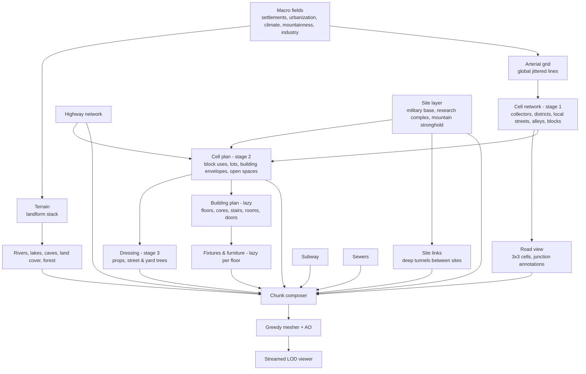

# Architecture

## Principles

1. **Everything is a pure function of `(config, structural key)`.** Nothing
   depends on generation order or on a shared RNG stream. Every entity derives
   its seed from the world seed plus a stable key (`Rng.from(seed, id, purpose)`).
   Caches can be dropped anytime; any worker can rebuild any piece.
2. **Plan semantically, voxelize last.** Layers produce records (roads, lots,
   envelopes, floor plans, boxes). Only the chunk composer writes voxels.
3. **Hierarchical and lazy.** Coarse structures are cheap and computed for large
   areas; expensive detail (interiors, furniture) is computed only when a LOD0
   chunk touches it.
4. **One generator, every LOD.** Generators write through a chunk writer in
   world voxel coordinates; the writer point-samples at the chunk's resolution.
5. **Validate what matters.** "All rooms connected" is checked twice: on the
   room/door graph, and physically with a voxel-level walker.

## Units and coordinates

- 1 voxel = **0.125 m** (`core/units.js`). All configs are written in meters and
  converted with `vx()`; the engine plans in integer voxel coordinates.
- World frame: x east, y south (N = −y), **z up**. The viewer renders in meters.
- Chunks are 32³ voxels (4 m at LOD0), stored padded to 34³ (1-voxel apron) so
  meshing and AO are seamless without touching neighbours. LOD k uses voxels of
  0.125·2^k m; a LOD k chunk covers 32·2^k LOD0 voxels.
- Buildings plan in a **canonical frame** (`buildings/frame.js`): u along the
  street facade, v from the front (v = 0) to the back. Frames are proper
  rotations of the world grid.
- **Placements** (`core/placement.js`) put a local voxel lattice in the
  world at an exact rational rotation: yaw, pitch and roll are quantized to
  Pythagorean triples (cos = q / r, sin = p / r), so both mapping
  directions are integer arithmetic and no sin / cos / atan2 is involved
  (bit-identical across platforms, and in structvox's C++). A frame is a
  thin wrapper over an axis-aligned placement, whose fast path evaluates
  the frame's own expressions. `config.world.angles` switches the angled
  world on (ANGLED_WORLD_PLAN.md); it is off in every preset, and
  `test/golden.test.js` checks that every preset then still generates what
  it did before, bit for bit (`scripts/golden.js --write` recorded it).

## Generation hierarchy

| Level | Key | Cache | Module |
| --- | --- | --- | --- |
| Macro fields, terrain | pointwise | none | `world/fields.js`, `terrain/terrain.js` |
| Arterial grid | line index | none | `network/arterials.js` |
| Cell network | cell (i, j) ~620 m | LRU | `city/cellNetwork.js`, `city/streets.js` |
| Road view | cell + 8 neighbours | LRU | `network/roadView.js` |
| Cell plan | cell | LRU | `city/cellPlan.js`, `city/lots.js`, `buildings/archetypes.js` |
| Dressing | cell | LRU | `city/dressing.js` |
| Building plan | building id | LRU | `buildings/interior/*` |
| Highways | lattice edge (~3.4 km) | LRU | `network/highways.js` |
| Subway | arterial line / node | LRU | `underground/subway.js` |
| Sewers | cell | LRU | `underground/sewers.js` |
| Town plan (landmarks) | settlement | on the settlement record | `city/townPlan.js` |
| Island landmarks | island (once) | on the world | `world/landmarks.js` |
| Sites | site lattice (~5.2 km) | LRU | `world/sites.js`, `sites/*` |
| Site links | lattice edge | LRU | `sites/links.js` |
| Landforms | pointwise | none | `terrain/landforms.js` |
| Biomes / land cover, rivers, caves | pointwise | none | `nature/biomes.js`, `nature/landcover.js`, `nature/rivers.js`, `nature/caves.js` |
| Lakes | 3.5 km lattice | LRU | `nature/lakes.js` |
| Forest | 5 m tree lattice, 2.5 m understory lattice | LRU (tree models cached on the records) | `nature/forest.js`, `nature/trees.js` |
| Ground cover | per column (LOD 0) | none | `nature/groundcover.js` |
| Park layout | park space | WeakMap | `city/parks.js` |

**Ownership rule.** A cell owns the arterial segments on its west and north
edges; street props are emitted only along roads a cell owns. Buildings never
cross cell boundaries (they live inside blocks), so neighbouring cells never
duplicate or disagree about anything.

## Terrain and landforms

`terrain/terrain.js` runs a stack of registered landforms
(`terrain/landforms.js`, each `{ id, order, init(noise), apply(ctx, st) }`
editing `ctx.h` in meters): the continental swell, hills, mountains, dry
plateaus (arid country stands up to ~260 m high, fading around towns), desert
mesas and dunes, canyons (never cut below sea level) and ravines. `ctx` carries the position, the
urbanization, the mountainness and lazy climate / desertness, so a landform
can depend on climate (canyons and mesas only where it is dry, ravines in wet
forest country). Landforms may leave hints (`canyon`, `ravine`, `ridge`) that
land cover reads, and a `stream` channel ({ d, half, extra, wet }): the
ground tile cuts a stream bed along canyon floors (a dry sandy wash in true
desert) and a creek at the bottom of ravines, and forests keep out of it.
Water anywhere (lakes, ponds, rivers, streams, sea) freezes into ice with
snow drifts where the climate at its surface is below the snow line.

**Continuity.** Terrain must be continuous at voxel scale: a jump of 1e-3 in
a noise that is scaled to kilometres of relief is a metre-high wall. So every
landform fades in with smoothsteps instead of switching on at a threshold
(mountainness, urbanization, desertness, isoline distance), and the 3D
simplex noise uses a kernel radius² of 0.5 (the common 0.6 reaches past the
simplex's corners and jumps by up to 0.005 at cell boundaries). Landforms
that follow noise isolines (`glacialValleys`, `canyons`, `ravines`) estimate
the distance as |v| / |∇v| with the gradient floored (`isoDistance`), since
near saddles of the noise the gradient tends to zero.

**Mountains.** `fields.mountainness` combines long belts (the crease of a
very low-frequency noise, 200 km scale, like fold belts along plate edges)
and isolated massifs (70 km). Both ramp up over tens of kilometres, which
keeps flanks realistic (median slope ~27°, 90th percentile ~47°, ~1% above
60°); on top the mountain landform raises a broad uplift plus ridged
multifractal relief of up to ~6 km. A seed-derived domain offset
(`fields.pickMountainOffset`) puts the spawn city in open country with a range
in view (`terrain.spawnMountains`), and towns are only placed where their
whole foothill buffer is free of mountains (`fields.mountainsAround`), since
fading a range down to a town would raise cliff walls. Country roads skip
edges steeper than ~14% (`cellNetwork.tooSteep`). Mid-scale ridged detail
(arêtes, couloirs) grows with height, and U-shaped glacial valleys (a
`glacialValleys` landform along warped-noise isolines, 1.4-3.6 km wide, up to
700 m deep, never below the foothills) break the ranges into ridges and
valleys. Over 20 m, mountain slopes have a median of ~29°, a 90th
percentile of ~55° and ~6% above 60°.

**Gullies and couloirs.** A `gullies` landform furrows mountain flanks
down the fall line, between sharp ribs, so rock faces and forested slopes
read as eroded rather than smooth. It is built from kernels on an 80 m
lattice, Gabor style. Each kernel carries stripes across its own downslope
direction, taken from a cheap copy of the range's relief (3 octaves, less
the glacial valleys) at the kernel and cached per kernel. Kernels are
weighted by how steep they are and blended with compact windows, so there
are no seams. There are two scales: couloirs ~140 m apart and gullies ~45 m
apart. Kernel phases come from a smooth noise, so grooves carry on from
kernel to kernel down the slope. Crests and flats, where the direction turns
over, get none. The lattice divides a wrapping world's period, so the
pattern repeats with it; kernels are pure functions of their position
(`ctx.toField` samples the chart at a kernel).

**Canyon walls** climb in bands of hard and soft rock: a bench, a concave
apron of scree (rubble in land cover), then a near-vertical cliff. The
number and proportions of the bands change slowly along the canyon, the
walls wander in buttresses and alcoves, and side gullies (a ridged noise)
bite deep into them. The stream keeps to the canyon's own line.

**Walking-scale relief.** A `relief` landform makes open country uneven. It
adds knolls and hollows (~170 m, up to ~7 m), hummocks (~22 m, up to
~1.3 m, sharper on rugged ground) and small bumps (~4 m: tree-throw mounds
and pits, stones under the moss). All three grow with the country's
ruggedness (`landforms.ruggedness`, `sample().rugged`). Rugged country is
glaciated shield country (cool and moist: the north, Karelia, the Nordic
islands, which add `terrain.rugged`), plus a slow regional noise, rising
into the foothills; mild lowlands are gentler. The relief fades out towards
towns, on beaches and along stream, ravine and canyon channels
(`ctx.channel`), so their beds stay even.

**Close up**, a `roughness` landform adds hummocks and knolls (2-6 m
wavelengths, up to about a metre) and blocky crags on high ridges to
mountain ground, so flanks are not smooth voxel staircases. Roughness and
the small relief are part of the height (every consumer sees the same
ground), but are left out of the slope that land cover reads
(`sample().rough`), so micro-relief does not turn meadow patches into rock.

**Land cover** (`nature/landcover.js`) cools temperature with altitude
(lapse rate), which moves the tree line and snow line with climate; cliffs
(by slope and a crag noise), scree, alpine meadows and pools overlay the
biome ground, and deserts show striped strata on steep ground. Rock
columns (cliffs, scree, alpine rock, sandstone) are filled with gently tilted
2.75 m strata of alternating rock shades, so cut faces, cliffs and canyon
walls show bedding. Above the snow line wind-scoured snow streaks the snow
fields and dark rock outcrops break through where it is steep. Boulders
(`nature/boulders.js`, feature source 6.5, LOD 0-2) lie on a 6 m lattice:
dense on alpine ground above the tree line, sparse in mountain forests and
foothills, some on canyon floors, and glacial erratics through rugged woods
and heath (granite, mossy on top, lichen on the flanks); half-sunk irregular
ellipsoids that fill air only, snow-capped near the snow line, kept off the same ground trees keep off
(`forest.clearGround`: roads, lots, site pads, water, streams, highways).
Cave mouths never open in snow; they are mossy below the tree line and gravel
above it.

**Lakes** (`nature/lakes.js`) sit on a jittered 3.5 km lattice (not in
towns); each has an irregular shore, a bowl-shaped bed and a level just below
the lowest point of its rim, so water never stands above the land. A share
are big lakes (1.4-4 km radius); half of those are moved against a nearby
town (`lake.port`). The town's waterfront is graded down to a harbour
terrace 3 m above the water within 400 m of the shore, rising behind it
(`terrain.portGrade`, a world hook; lakes sample raw terrain, so there is no
cycle), and blocks near the shore become the `port` district: each yard the
lake reaches gets a straight quay (`industry.portQuay`) with a dredged basin
beyond, ship-to-shore cranes and moored cargo ships; a yard the lake
covers entirely is reclaimed out to a 60 m apron. Like
rivers they are carved only by the ground tile; planning keeps off them with
`world.waterHitsRect`.

**Outcrops and creeks.** In cool, wet country an `outcrops` landform
raises glacially smoothed granite knolls a few metres high (and low rock
slabs on island shores): ragged outlines, joints cracking them into slabs,
low ledges. It leaves `ctx.outcrop`, which the ground tile
turns into bare granite with lichen and moss (trees mostly keep off); a
`creeks` landform cuts small winding streams along the isolines of a warped
noise (`terrain.creekScale`, ~900 m) through woods and meadows, as a
`stream` channel like ravine creeks. Creeks and ravines never cut below
1-1.5 m above the sea, so a low island's gorges stay dry instead of
flooding. `LandCover.clearing` opens meadow glades in the woods (lush grass,
flowers in summer).

**Caves** (`nature/caves.js`) are worm tubes plus caverns from 3D noise
below the countryside (to `caves.depth`). The source evaluates the field on
a coarse 4-voxel grid and interpolates, then decorates floors (moss near the
mouth, gravel), stalagmites, stalactites and crystals.

## Chunk composition

`voxel/compose.js`:

1. **Ground tile** (per LOD column tile, cached): for each of the 34×34 columns,
   surface z, top/sub material and water level — composed from terrain, the
   road surface SDF, site pads, lots, open spaces and natural land cover.
2. **Ground fill** of the chunk from the tile.
3. **Feature sources** in `order`: caves (1), sewers (2), subway (3),
   sites (4), site links (4.5), highways (5), boulders (6.5), forest (7),
   dressing (8), skybridges (9), buildings (10). Each implements `zRange(world, rect, lod, tile)` (so
   the streamer knows which chunks of a column have content),
   `rasterize(world, chunk, tile)` and an optional `maxLod` (caves, link
   tunnels and boulders 2, forest 3, sites 7). Underground sources carve by
   writing air; shells use "replace solid only" boxes so they never refill a
   carved space. Trees go before buildings so buildings overwrite any crown
   that reaches into a room.

## Roads

Roads are straight segments or polylines with a cross section
(`network/roadClasses.js`). The surface sampler (`network/roadSurface.js`) evaluates
signed distance fields per column: the carriageway union uses a circular
smooth-min between different roads (exact curb fillets at every junction),
the right-of-way uses a sharp min (square property lines). Markings,
crosswalks, stop lines and medians are resolved in the dominant road's frame
using junction annotations computed on a 3×3-cell road view, so roads owned by
different cells still know about each other. Two roads meet where their
centre lines cross within both. They also meet where one's end lies in the
other's carriageway, off its centre line (a side road winding into a winding
village street), if that end meets no other road and the two meet nowhere
else: the junction is where the end lies (`roadView.js endIn`, decided after
the plain junctions, whatever order the roads come in; test/roads.test.js). Without
it the two would keep levels of their own, and the side road's end would
stand in the street as a ledge or a wall. (An end that meets another road
already has that junction's level.)

**Road levels** (`network/roadLevel.js`). Streets are built, not draped over
the terrain:

- **Profile.** Every road gets a vertical profile along its centre line,
  from terrain samples every 8 m, smoothed over ±16 m. The profile is a
  balanced cut-and-fill fit: the mean of the highest grade-limited profile
  that nowhere rises above the ground (all cut) and the lowest that nowhere
  dips below it (all fill). A road over a bump or up a scarp therefore runs
  half in a cutting and half on an embankment, not on a long ramp of fill.
  The grade limit is the class's comfortable grade (arterial 8%, collector
  10%, local 12%, village 13%, alley 14%, lane 16%). It relaxes where the
  land itself is steeper, up to the class's steepest (10–18%): hill towns
  have steep streets. A short road between very different end levels grades
  as steep as it must.
- **Ends.** An end that meets a through road (a T) is pinned to that
  road's own level there; that road's profile is fitted between plain node
  levels, so there are no chains or cycles. Other ends are pinned to the
  node level: the ground averaged over a 20 m disc round the node, the same
  for every road meeting there. A junction on the lip of a scarp therefore
  doesn't drag all its roads to the lip.
- **Level across.** A road is level over its whole width, sidewalks
  included.
- **Junctions.** At a T the road that goes on through keeps its level. At a
  crossing or a corner the more important road does (by rank, then id).
  Each junction has a level box: the crossing road's right-of-way for the
  road that meets it, and only its carriageway for the dominant road, so a
  steep street with side streets a few metres apart can still climb between
  them. Between junctions, the nearest junction on either side pulls the
  road's profile towards its level. The pull fades over a blend of 12–96 m
  that lengthens with the offset. Where two blends would overlap, both
  shrink to share the gap; where two boxes overlap, the level eases from one
  to the other. The level is continuous and does not depend on the order the
  junctions are found in. Junctions are collected along the whole road
  (`seg.rj`, road view), so a wobbly street's vertices don't cut a blend
  short.
- `segmentLevel(world, seg, along)` gives the carriageway level;
  `roadLevelAt(world, view, x, y, reach)` gives the level of the nearest
  street at a point, and `world.streetLevel(x, y)` is the global shortcut.

The ground tile writes road columns at that level and, in open country, cuts
or fills the natural ground towards the road edge in an embankment. The
embankment is up to 14 m wide, and its width grows with the height
difference. `compose.naturalGroundAt(world, x, y)` gives that shaped natural
ground (terrain, embankments, graded town ground) for a single column; wild
trees, plants and street props outside a right-of-way stand on it.
`compose.spaceGroundAt` does the same for open spaces (graded, their own
dips and beds, river banks carved in); park trees and furniture stand on it.

Everything else that stands on a street asks the same functions:

- **Blocks.** A Coons-patch surface stretches between the sidewalk levels on
  the block's four sides (`cellPlan.blockSurface`). Parks, plazas, courtyards
  and leftover ground follow it. A block's buildable rect keeps clear of
  every street's right-of-way (`cellPlan.clearOfStreets`): where a wobbly
  old-town street, or a street of the next cell, reaches into it, that side
  moves in. No street runs through a lot or a building.
- **Lots and pads** (site grading, `city/grading.js`). A building stands on
  a level pad at its entrance level: the sidewalk in front of it (a slab's
  middle in a superblock). The pad is its footprint and annexes, a 1.5 m
  apron, and a civic building's forecourt. Around the pads, the ground of a
  block eases back to the block surface over a band that widens with the
  height difference (at most ~1:1.5). That ground may be a garden, a yard, a
  courtyard, a park or leftover. The pads of one block pull on all of it;
  where pads crowd each other their pulls are averaged. On a hillside a
  house therefore sits on a terrace with its garden sloping away, and
  neighbours meet without cliffs. Where a slope has no room, the rest is a
  retaining wall (capped with a parapet). Lots that need one level surface
  stay a single terrace at the entrance level, and act as one big pad for
  the ground round them: work yards, car parks, petrol forecourts,
  schoolyards and wharves. `SiteGrading.at` (`plan.grading`) is the one
  answer for graded ground; the ground tiles and everything placed in yards
  and spaces ask it.
- **Everything else.** Street furniture, subway entrance stairs, sewer
  manholes and hall stairs, and highway ramps all sit at street level.

Rural and village blocks keep their natural ground (fields, farmyards)
apart from the embankment along the road and the pads of their houses.
Tests check that the carriageway varies by at most one voxel across any
cut, that neighbouring columns stay within a 20% grade (junction blends
included), and that lots sit within two voxels of their sidewalk, on the
hilliest town ground near the spawn (`test/roads.test.js`).

**Fit audits** (`validate/fit.js`, `test/fit.test.js`,
`scripts/audit-fit.js`):

- height steps between neighbouring ground columns, by what meets what
  (road, lot, open space, nature, field);
- jumps in a road's level between points 2 voxels apart;
- buildings standing on road surface;
- trees, plants and yard trees not standing on the ground.

The tests pin these down on the steepest town ground of the White Sea and
fjord presets.

## Buildings

1. **Envelope** (`buildings/archetypes.js`, cheap, in the cell plan):
   footprint tiers, floors, story heights, basements, roof type, program,
   style, entrance position. This is all distant LODs and the map need.
2. **Plan** (`buildings/interior/plan.js`, lazy): per-floor `FloorGrid`
   label grids (OUT / EXT / WALL / DOOR / rooms). Typical floors share one grid.
   - Cores first: stairs (+ elevators) derived from the smallest tier so they
     stack from the lowest basement to a roof bulkhead.
   - Floor planners: `apartments.js` (double-loaded corridor or point-access
     sections), `offices.js` (central core, open ring, enclosed rooms, lobby
     with shops, parking basements), `houses.js` (stair column + hall + rooms),
     `industrial.js` (hall + two-level annex with a mezzanine floor).
   - Units (`units.js`): templates (band, through, railroad, open) tried
     against the real grid, mirrored to meet the entry, rolled back when any
     required door cannot be placed on an actual shared wall.
   - Doors are only ever carved where two rooms really share a wall;
     exterior doors default to the street facade.
3. **Validation**: `validatePlan` floods the door graph from the exterior
   doors through stairs; `validate/walkability.js` floods the actual voxels
   with a 0.5 m × 1.75 m walker (2-voxel steps).
4. **Voxelization** (`interior/voxelize.js`): slabs with per-room finishes,
   painted partitions with baseboards, 2-cell facades whose windows follow the
   same bay grid as the massing LODs (recessed glass, sills, storefronts),
   openings, ceiling lights, stairwell slab openings; then boxes from
   `fixtures.js` (stairs, bulkheads, door frames, open leaves, entrance steps,
   canopies, awnings, roof gear) and `furnish.js`.
5. **Furniture** (`furnish.js`, `prefabs.js`): per-room occupancy grids with
   door clearance; tall items avoid exterior walls; every placement is kept
   only if a 4×4 walker can still reach all of the room's doors.

### Civic buildings, venues and big shops

`buildings/civic.js` registers the civic archetypes from one table
(`CIVIC`: footprint, floors, story heights, setbacks, lot size, what the
front shows: a shop window, a sign kind, a portico, a petrol canopy, a car
park). The envelope passes these through `env.extra` (`civic`, `sign`,
`signColor`, `storefront`, `portico`, `parking`, `setF`); canopies and
price pylons are open annexes drawn at every LOD (`massing.openAnnex`).
`civicStyle(id, flavorId, rng)` picks the facade by flavor group (default,
nordic, soviet): classical stone, Stalinist, panel, wooden, glass.

Interiors (`interior/civic.js`, programs in `interior/civicPrograms.js`):

- `planHall`: a foyer band across the front (a stair at one corner, side
  rooms such as a cloakroom or a kiosk), one to three halls behind it
  (auditorium, cinema screens, venue floor, supermarket sales floor, market
  hall), a back band (dressing rooms, stores) with a loading dock. Two-floor
  halls are double height: the upper floor over a hall is a `void` room (its
  slab left open, exempt from the reachability checks); the landing over the
  foyer is a foyer bar, a dance hall or offices.
- `planCorridor`: a double-loaded corridor with a stair at each end; each
  floor's program lists front and back rooms (`at` mid/start/end, `span`
  bays, `split` into small rooms, `lobby` with the entrance, `ext` doors
  and roll-up doors to the street or the yard) and fill rooms. Hospitals,
  polyclinics, police and fire stations, museums, art galleries, libraries,
  town halls and hotels.
- `planKiosk` (a petrol station's shop) and `planDepartmentStore` (a core
  and open sales floors).

Furnishing rules (`interior/civicRules.js`) and prefabs
(`interior/civicPrefabs.js`) cover every new room type (beds and curtains,
operating tables, holding cells with bars, fire trucks, display cases and
paintings, stages and seat rows, checkouts and shelving, market stalls,
racks, conveyors, storage units, an icon screen...). Street fronts
(`interior/civicFixtures.js`): shop signs coloured by kind over every shop
door, and for civic buildings the sign (fascia, marquee, neon, red cross
with an ambulance porch, police band, fire band, banners, name plate), the
portico (stylobate level with the ground floor, columns, entablature,
pediment) and the pump islands. Lot surfaces (`landscape.civicYard`): car
parks with stalls, petrol forecourts, fire station aprons, stone
forecourts, lawns and service yards.

Warehouses in town districts draw what they hold from their own stream
(`program.ground`: warehouse, distribution, selfStorage, coldStore,
timberYard; site warehouses stay plain); `industrial.js` gives the hall
that type. Churches in towns whose flavor has `churchDome` (Soviet, White
Sea / Karelian) carry onion domes: `steeple.dome` (a drum and bulb on the
tower, or `steeple.tent`: a tented spire with a small onion) and
`env.domes` along the nave ridge (`massing.onion`), with an
`orthodoxNave` inside.

## Highways

`network/highways.js`. Every rule is a pure function of the lattice round
an edge.

- **Network.** Nodes sit on a jittered ~3.4 km lattice. An edge always
  exists along intercity routes: each settlement links to its east and
  south neighbours by an L-shaped lattice path, within the grade limit.
  Inside urban areas edges exist by chance, but only between two urban
  nodes and never as a spur: a chance edge needs another edge at both of
  its nodes, tested over two pruning passes. No highway ends in the air.
  The rare route that ends at a town (its last node) comes down to the
  ground there and ends at grade, open.
- **Deck.** Edges are Catmull-Rom splines resampled every 8 m. The deck
  profile has hard lower bounds (clearance over urban land, crossing roads
  and rivers) and a soft target near the terrain elsewhere. A two-way 5%
  grade limit (over the samples' shortest chord, so it holds exactly),
  smoothing and a cone clamp to the shared node heights produce the final
  profile, unrounded; each column rounds its own level.
- **Junction plateaus.** Where three or four highways meet, or at a
  terminus, the deck is level at the node's height over a plateau 2.5
  deck half-widths round the node, then returns to the profile within the
  grade limit. Over the plateau no barrier crosses the carriageways; a
  railing runs round its rim (where an arm's edge is no other arm's
  carriageway).
- **Interchanges** (`ramps`), where a highway crosses an urban arterial:
  up to four ramps, each a 7 m band from the deck's edge.
  - A ramp's ground end lies inside the arterial's carriageway, where its
    centre line enters it before the crossing or leaves it after, at that
    street's level.
  - Its level is the deck's, less a drop that closes from the landing to
    nothing at its deck end, eased over 15% of its length at each end. So
    it lands level with the street and meets the deck tangent to it.
  - It is as long as its steepest grade, the deck's own included, keeps
    within 7% (at most 320 m).
  - A ramp is left out where a junction plateau is too near, or another
    street would pass under it with less than 4.5 m of headroom (2.5 m over
    a sidewalk): there it would block the street.
  - Where a ramp meets the deck, the barrier opens.
  - The ramps a street's layout leaves out make many interchanges partial.
- **Piers** every 32 m, never on a street's carriageway and never left
  out. A station over a street moves along the deck by up to 12 m; a
  street under the deck all along gets a portal, a column on either side
  of it under one cap. A junction plateau stands on a column at its node
  and a ring between its arms. Ramps stand on piers every 24 m, each
  moved off any street under it.
- **Around them.** City trees and props keep a crown's reach off decks
  and ramps (`covers`), and nothing reaches up into one (`underside`: a
  car fits under a deck, a crane does not; nothing fits under a ramp near
  the ground). Lots and spaces under a corridor get no buildings.
- **In the voxels.** The rasterizer reads the actual ground under each
  column. More than 7 m of cover bores a lined, lit tunnel; less cuts an
  open cutting with retaining walls (a ramp too). A low deck in open
  country sits on an earth embankment with grass slopes; higher decks
  stand on their piers.
- **Checks.** test/highways.test.js: no spurs or dead ends, grades, ramps
  landing on their arterial at its level and clear of the streets under
  them; in the voxels, a ramp's centre line climbs a voxel at a time onto
  the deck, through the barrier's opening, and a junction is level and
  free of barriers. The highways' lanes are in the structvox export
  (`svx/highwayLanes.js`, §structvox).

## Underground

- **Subway** (`underground/subway.js`): lines under every second arterial,
  stations at arterial crossings, tunnels rasterized per column between them;
  over the last 40 m before a station the two running tracks spread to the
  island-platform tracks and the tunnel widens with them, sleepers in the
  same world phase as the station's.
- **Sewers** (`underground/sewers.js`): planned per cell from the roads the
  cell owns. Every junction, dead end and ≤ 80 m interval is a node whose
  invert height is a pure function of its position, so runs planned by
  different cells meet exactly. The rasterizer picks one profile per column
  (chamber interior > run interior > chamber wall > run wall), which opens
  tunnels cleanly into chambers. Runs and chambers that would touch a subway
  station are dropped (again a pure test). Where a cell's two collectors
  cross, a sunken overflow hall gets a stair up to the sidewalk; other
  chambers have ladder shafts to manholes.
- **Ladders** are a material flag (`climb`). Workers send a climbable
  bitset next to the solid one; the walker climbs when in reach, and
  `floodRegion(..., { climb: true })` validates ladder routes.

## Sites and underground complexes

`world/sites.js` anchors at most one site per ~5.2 km lattice cell (chosen by
frequency, then accepted by its placement rules). A definition provides
`plan`, `surface` (archetype envelopes merged into the cell plan, so surface
buildings get validated interiors), `ground` (pad materials; the site's pads
level the terrain: flat rects, `ramp` pads rising along an axis, or `path`
pads, ribbons along a polyline with their own levels, e.g. a road cut into a
slope; where blend zones overlap the nearest pad wins), `structure`
(boxes + custom volumes, rasterized by one generic feature source), `pois`
and optionally `place` (custom placement returning pads) and `port` (a link
tunnel anchor). Structures are box lists (shells "replace solid only",
carves, details) indexed in a spatial grid; boxes keep their insertion index
so rasterization order never depends on the grid. Custom volumes
(`{ bb, rasterize(chunk) }`, e.g. a rock cavern) rasterize before the boxes.

`sites/complex.js` is the shared Doom / Black Mesa complex generator:
`planComplex(rng, { sectors, entries, tram })` plans sectors (bounds, top
level, level count, theme), each level a set of rooms (rect / octagon / round
/ cross shapes; themed types: labs, cleanrooms, server rooms, containment
cells, reactor halls with catwalk rings, test chambers, atriums spanning two
levels with a catwalk ring above, hangar halls with nukage channels, mess
halls...) joined by corridors: pairs of rooms nearest first (union-find),
each with the first L / Z route that avoids shafts and open atrium floors,
then a few loops; rooms no route can reach are dropped. A stair shaft links a
sector's levels (and its tram station), entry shafts climb to the surface,
ladders add shortcuts, and a tram loop joins the sectors' stations.
`COMPLEX_THEMES` sets room weights, the big room per level, frame and accent
colours. Every room of every level is checked with the voxel walker.

- **Military base** (`sites/militaryBase.js`): fenced compound, bunker, one
  military sector.
- **Research complex** (`sites/researchComplex.js`): campus (offices, hangar,
  parking garage, radomes, dishes), two portals, four themed sectors at
  staggered depths, tram loop.
- **Mountain stronghold** (`sites/mountainBase.js`): custom placement finds
  a flank (axis direction) where a cavern floored at the portal level keeps
  40 m of rock over its vault and the tunnel stays under rock. The apron is a
  rounded pad levelled at its centre's ground height (rock cut faces behind,
  gravel fill in front); a service road (path pad) leaves the fence gate on
  the side closest to the apron level and descends at 9%, each 8 m step
  turning toward the ground matching its level, so it follows the contours
  and folds into hairpins without crossing itself; a concrete
  headwall with blast doors, a cut-and-cover section and a lined tunnel lead
  to a vaulted cavern (custom volume: rough shotcrete walls, steel arch ribs,
  hanging lights) with underground lots (`lot.underground`: buildings on the
  cavern floor that leave the surface above alone), a yard with a portal
  block down to two sectors and a tram.
- **Site links** (`sites/links.js`): neighbouring sites with ports are
  joined by chance with an L-shaped service-road tunnel. The floor runs
  straight from port to port but is capped by a grade-limited envelope 30 m
  under the terrain, so it dives under valleys; links too long or too steep
  are skipped. Links rasterize after the sites (order 4.5): the bore clears a
  passage through anything it crosses, the lining only fills solid rock.
- **Tram** (`complex.planTram`): stations lie along each sector shaft; the
  loop always enters and leaves a station along its platform and swings
  round outside the station halls between rows; rails curve on quarter
  circles at the corners and lie on sleepers.

## Settlements, villages, farms

Towns sit on a 9 km lattice; villages and hamlets on a 3.6 km lattice
between them (`fields.village`), kept clear of towns and mountains. They
count as settlements for terrain grading and flavors but peak at low
urbanization and never get a downtown, highways or a subway. A village cell
gets its own main street (and a cross street when large) through the
village centre (`cellNetwork`, class `village`: two narrow lanes, slim
sidewalks); the `village` district strings house plots along its streets,
thinned out towards the edge (`lots.villageLots`, `cellPlan`). Country blocks
get farms (`lots.farmsteadLots`): a farmhouse plot and a barn plot side by
side; the `barn` archetype is a gabled hall (planned like a warehouse, with
stalls and hay stacks), the dressing adds silos, bales and fences.

### Default city layout

- **Main roads.** An arterial-grid edge in a town is an avenue on the
  subway lines and near the centre (core > 0.3); about half the other lines
  are two-lane collectors (`edgeInfo`, hashed per line), so the grid reads
  as a few main roads with streets between them.
- **Collectors** (`planCellNetwork`): a town cell is divided by a plain
  cross (30%), a cross whose north-south street jogs 30-90 m where it meets
  the other (32%), a T whose north-south collector stops at the other
  (26%), or a single east-west collector (12%).
- **Grids** (`gridStreets`): block widths vary ±15%, and north-south
  streets jog 8-25 m at a crossing now and then (`streets.jog`); streets
  are split into runs at the jogs, cross streets span both rows.
- **Historic core** (`flavor.oldCore`): districts within that share of
  the town radius become `oldcore` (organic cobbled blocks, pitched roofs);
  a sub-cell the core reaches into is laid out adaptively, block by block.
  Churches take the flavor's `churchStyle` (wooden in the north), else a
  rendered or a brick church.
- **Junction levels** (`roadLevel.segmentLevel`): every junction in reach
  offsets the road's own profile (the junction level over the box, the
  offset at the box edge fading out over the blend), farthest first and
  nearest last, so levels stay continuous where junctions lie close
  together (jogs); the blend lengthens with the offset so the extra grade
  stays small on hilly ground.

### Town layout

A town is planned in three passes, all pure functions of position:

- **Shape.** `fields.urban` falls off over a wide rim (d 0.34-1.06 of the
  radius) and every place has lobes (`settlementDistance`: a noise at about
  its own size, faded out beyond 3 radii so far towns cost nothing), so
  towns spread in arms instead of disks.
- **Network and blocks** (`cellNetwork`). A sub-cell whose centre is rural
  but which the town reaches into (a corner or edge midpoint with u > 0.17)
  is laid out as the town's outskirts (`sub.fringe`). The street pattern
  emits its roads and blocks into pending lists; then every block is looked
  at on its own: on the rim (u < 0.6) it is kept only where `u + 0.2 ·
  fringeNoise + jitter > 0.2`, and it takes the district of its own centre
  (`districtAt`: the macro classification plus the flavor), not the
  sub-cell's (parks and open country excepted, superblocks only on big
  blocks). Only then are the pattern's streets built: those that front a
  kept block, trimmed to the stretch they serve (dead ends into the fields
  are natural); alleys are added to kept blocks. In `cellPlan` houses on the
  rim drop out lot by lot (`outskirts`).
- **Patterns.** `organic` (`streets.js`) splits a rect at 30-70 % (never a
  sliver), so blocks come in every size, streets end at T-junctions and jog;
  some cuts are narrow `lane` roads (3.5 m, no sidewalk). With an
  `adaptive` flavor every rect it splits asks `emit.local(rect)` for the
  district at its centre (or its most urban corner), so the block size, the
  street class, lanes and paving follow the town: small cobbled blocks in
  the old core, big yards by the works; the harbour is decided block by
  block.
- **Flavor knobs** (`city/flavors.js`): `mainRoad` (class of the arterial
  edges through the town, e.g. narrow `village` streets), `mainRoadWobble`
  (they bend; blocks keep back by the bend, `edgeInfo.wob`), `cobbleWithin`
  (old-town main streets are cobbled), `collectors: false`, `patterns`,
  `adaptive`, `pitched` (chance per district that a flat-roofed walk-up or
  mid-rise gets a gable along the street or a hip roof), `blockUse` (block
  programs per district). Roads carry `paving: "cobble"`: setts in three
  shades with dark gutters, flagstone pavements, iron lanterns
  (`oldLamp`) instead of street lights.
- **Landmarks** (`city/townPlan.js`). Once per settlement: market square
  (towards the harbour), main church (the highest of a few spots), cemetery
  (on the quiet side, away from the works and the water), parks, schools,
  a sports ground, allotments, garages and a wasteland (by the works) and,
  in a harbour town, the wharf. Each is a point; `landmarkUse(world,
  block)` gives a block the use of the landmark whose nearest suitable
  block (by district and size, searched in the stage-1 cell networks, so
  there is no cycle) it is. New block programs: `square`, `garden`,
  `cemetery` (with a chapel lot: the church archetype with `chapel`),
  `allotments`, `garages`, `wasteland`, `wharf` (row lots whose fronts face
  the harbour get the `wharfhouse` archetype); each has a surface in
  `landscape.js` and dressing in `dressing.js`. Oversized sports grounds,
  squares and car parks become ordinary lots.
  Civic buildings are landmarks too (`civicAnchors`): by town size and
  flavor group a town hall by the square, hotels, museums, art galleries,
  a concert hall (a house of culture in Soviet and Karelian towns), cinemas,
  libraries, music clubs and a department store round the centre, police
  and fire stations, a hospital (polyclinics in smaller and Russian towns)
  on the quiet side, a market hall by the harbour, supermarkets further out
  and petrol stations on the edge. A town's landmarks are resolved together
  in order of importance and each block is claimed once; civic ones keep
  off blocks a highway crosses. A `civic:<id>` block gets the building's
  lot (`CIVIC[id].lot`) on its main street (another street side if it only
  fits there), at a corner or in the middle, and plain lots or superblock
  slabs on the rest (`cellPlan.civicLot`).

Flavors can re-map districts (`flavor.districts`): Soviet towns keep a
Stalinist downtown and turn everything else into `microdistrict` superblocks.
Superblocks (`blockUse` `micro`, also used by the `projects` district that
lines the industrial quarter's fringe) are one shared courtyard space
(parking band, lawns, footpaths, trees, playgrounds, lock-up garages) with
freestanding `panelSlab` / `panelTower` lots on it (`lots.microLots`). Both
archetypes are planned by the apartment planner (one stair section per
entrance, lifts above five floors); the `panel` style draws prefab panel
joints on the facade (a `joint` material on every bay edge and slab line).

Parked vehicles (street parking, garage and basement stalls, trucks at
sites) are optional: `config.vehicles.parked`, off by default.

## Heavy industry

Every town gets an industrial quarter: `fields.industryNoise` adds a wide
sector of the outer ring (side picked per town) to the industry noise; its
far part becomes the `heavyIndustry` district (large blocks, factories and
warehouses) whose block programs include tank farms and container yards
(`city/industry.js`). One deterministic layout per space drives both the
ground surface (landscape) and the props (dressing): bunded storage tanks,
pipe racks, distillation columns and a flare stack; container stacks in
blocks with lanes and gantry cranes. Tall props stay visible at coarse LODs.

## Buildings with ramps

Plans may carry `ramps` ([{rect, f, H}], rising +v from floor f to f+1) and
`links` (room connections that are not doors or stairs). The voxelizer draws
a ramp column for both the floor it starts on and the floor it arrives at,
with curbs along both edges; `validatePlan` treats links like stairs. The
parking garage (`interior/garage.js`) stacks one ramp per deck along a side
wall so every deck repeats the same circulation.

## Skybridges

`city/skybridges.js` runs at the end of the cell plan, when every envelope
of the cell is known: office-like buildings whose fronts face each other
across a street get a bridge at a podium floor where both buildings have a
floor within 2 voxels of the same height. The bridge is stored on the cell
plan (geometry, rasterized by the `skybridges` source) and on both
envelopes as `skyDoors`; the lazily planned office floors then carve a glass
door exactly where the bridge lands. Pairs never cross cells, so the
decision is local and deterministic.

## Nature and biomes

`nature/biomes.js` registers biomes with a climate centroid (temperature,
moisture), vegetation (forest multiplier, meadow chance, weighted tree
kinds), ground materials, farmland and ponds. `LandCover` cools temperature
with altitude, picks the nearest centroid (with a little noise so borders
interleave), and applies elevation overlays (beaches, rock slopes, scree,
the snow line). Climate varies over `world.climateScale` (32 km), so
biomes form regions; on a planet chart temperature also follows latitude.
Rural blocks stay natural land with a few farmsteads; settlements pick a
flavor (styles, heights) that can depend on their climate. Biome ground
functions get a column hash `h` and a ~5 m noise `p2` besides the ~11 m
`patch`, and mix their materials by comparing `h` with a smooth ratio: a
dithered drift instead of flat blobs with hard outlines.

**Trees** (`nature/trees.js`). A tree record is `{ x, y, z, h, r, kind,
seed, look?, open? }`. `treeModel(t)` builds its parts once from the seed
and caches them on the record: limbs (capsules with a taper: the trunk
with a flared foot and a lean, forking limbs, twigs), foliage blobs
(ellipsoids with a lumpy 2-voxel-noise surface; satellite blobs round each
cluster so crowns end in an irregular outline), spruce / juniper cones
(drooping whorls in irregular lobes), willow curtains and fern fans. Each
kind has a builder (`BUILD`): the broadleaf builder places limbs from a
fork at a species-specific height, fills the crown from the fork to the top
cluster and adds fillers so there is no hollow; birches carry small
clusters on a white stem, pines tufts on a long bare trunk. The rasterizer
shades foliage by exposure (sunlit top, body, shadowed underside and
interior) from a palette per kind; the season's look (`world/season.js
treeLook`: palette, `mix` share of clusters turned, bare, snow, holes,
berries) swaps the palette cluster by cluster, strips broadleaves to limbs
and twigs, and lays snow on upper surfaces. At coarse LODs clusters are
smooth and slightly inflated, twigs vanish, thin limbs drop out.
`scripts/render-trees.js` renders a gallery of every kind.

**Forests** (`nature/forest.js`). Trees sit on a jittered 5 m lattice,
thinned by `LandCover.forestDensity` and a ~30 m clump noise
(`Forest.clumped`). `species` draws from the biome's weights, each
multiplied by the species' own stand noise (~190 m) and by the site (pines
on outcrops, birches and rowans at edges and in the open, spruce in the
dense wood), so the woods come in stands with mixed borders. Crowded trees
grow taller and slimmer (`open` false: conifers lose low branches), open
ones broader; young trees fill gaps and edges; a dead snag now and then in
old conifer wood. An understory on a 2.5 m lattice (LOD 0-1 only):
ferns, blueberry, shrubs, junipers, saplings, fallen logs and stumps under
the trees, shrubs and saplings along the edge. `coniferShare(x, y, hM)`
gives the stand mix to the distant canopy (compose.js), which draws pointed
conifer crowns and rounded broadleaf ones in their seasonal colours, with
foliage down to the ground at the forest's edge. `nature/groundcover.js`
(feature source, LOD 0) grows tufts of tall grass in drifts, wild flowers
(stem and head) and reeds along water on natural columns of the ground
tile.

Woods are thick and varied:

- **Denser stands.** In the densest stands a cell's second tree (a younger,
  smaller one of the stand's species) stands under the canopy, so thick
  woods hold more than one tree per 5 m cell.
- **More species.** Aspens (pale stems, small high crowns, flaming in
  autumn), alders (dark egg-shaped crowns, along the water), larches (airy
  tiered cones, gold in autumn and bare in winter; in the dry continental
  taiga, hardly on wet Atlantic coasts) and hazels (clumps of stems at the
  edge of broadleaf woods) join the species.
- **Undergrowth.** The understory is thicker, with more saplings,
  deadwood, ferns and junipers. Thickets (a noise) are patches of dense
  young growth, and rugged ground holds more deadwood and junipers.
- **The forest floor up close** (`groundcover.js`, LOD 0) carries
  blueberry and lingonberry carpets in the northern woods (berries in
  summer, red leaves in autumn), moss cushions, herbs and woodland grasses
  under broadleaves, heather in clumps (in bloom late in summer), and
  stones, twigs and cones, with a mushroom now and then.

Placement follows the site:

- Trees stand on the ground as the tiles shape it
  (`compose.naturalGroundAt`: embankments, graded town ground).
- No trees grow on ground steeper than ~45° (scarps, embankment faces), and
  fewer above ~35°.
- On dry, steep slopes pines take over from spruces.
- River, lake and creek banks carry a belt of willows, birches and poplars
  even in open country (`Forest.freshBank`), but the sea shore does not.
- Some stretches of country road near towns, villages and farms are
  avenues (birch alleys in the north, oaks and limes further south, poplars
  where it is hot; dressing.js).

**Farmland** (`nature/farmland.js`). Farm country is cut into farm blocks
of 300 m, each split into 2–6 strips of varying width across its own
direction; a strip is now and then cut once more across. Every field has a
crop by climate and shows the season:

- Where it is mild: wheat, barley, rapeseed, potatoes, maize, hay, pasture
  and fallow.
- In the north: hay, pasture, barley and potatoes.
- In hot country: maize and pasture.
- Through the year: young shoots in spring, rapeseed in flower, golden
  wheat and mown hay in summer, stubble and ploughed soil in autumn.

Fields are separated by grass margins. Some boundaries carry a hedgerow
(shrubs on the understory lattice, a tree now and then); in the north,
some carry a low wall of cleared field stones (a bump on the ground tile).
Where fields lie:

- round every farmstead, out to ~240 m with a ragged edge, within its
  rural block (`plan.farmAt`);
- in wide stretches of mild farming country (`LandCover.farmMask`),
  thickest round the towns and villages;
- in the north, only in small plots close round them.

Fields replace the woods and only lie on gentle ground. Their ground-tile
columns are kind 6 (field), so caves, boulders and wild meadow plants
leave them alone.

**Parks** (`city/parks.js`). `parkLayout(space)` places entrances on the
sides, a hub off-centre, curved walks (quadratic, sampled into a bucketed
segment grid) from every entrance to the hub plus a cross link or two, an
irregular pond (a few harmonics on its radius, stretched and rotated) with
a walk round most of it, and a grove noise. `parkSurface` paints lawn,
unmown meadow, walks with gravel edges, the hub with flower beds, reeds
and mud round the pond; `dressPark` (dressing.js) plants groves of one
species each, solitary trees on the lawns, willows by the pond, shrubs at
the grove edges, and puts benches and lamps along the walks.

**Rivers** (`nature/rivers.js`) follow the zero isolines of a
domain-warped noise, with a second noise fading them in and out (springs,
varying width), so they are pure functions of position. Planning never
sees them as terrain: heights stay uncarved for lots, stations and sewers,
which keep clear with `rivers.hitsRect`, and city blocks crossed by a river
become riverside parks. Only the ground tile carves the channel (sloped
banks in the countryside, quays in cities) and turns road columns over the
channel into bridge decks with piers and railings. The water level is the
minimum of the terrain sampled around the point, lowered and quantized, so
it never floats above the land.

`stream/queries.js#overview` rasterizes biomes, relief, settlements,
highways and sites for any region; the map's World layer and
`scripts/render-overview.js` use it.

## World modes and presets

`config/presets.js` registers presets (`PRESETS.register({ id, label,
description, sizes?, config(size), viewer? })`): config overrides plus a
viewer mood (`viewer.atmosphere`: sky colour, fog density, sun and ambient
intensity, the sun's highest altitude, desaturation; `viewer.timeOfDay`).
`presetConfig(id, { size, seed })` resolves one; the viewer, the scripts
(`--preset`, `--variant`) and the tests all go through it. `makeConfig`
layers mode-dependent defaults between `DEFAULT_CONFIG` and the overrides
(an island's terrain scales, a wrapping world's lattice spacings) and is
idempotent, so the fully merged config a worker receives merges to itself.

### Wrapping worlds (`world.chart = "torus"`)

The world repeats every `world.size` metres in x and y (rounded to a
multiple of 240 m). Nothing is ever cut at a seam: positions stay unwrapped
(the plane is one self-consistent function, streaming and the viewer are
unchanged) and every generator is made **periodic**, so walking `size`
metres east brings you back to the same town, streets and buildings:

- **Continuous fields.** `TorusChart.toField` maps (x, y) to a point on a
  Clifford torus in 4D, `[R cos a, R sin a, R cos b, R sin b]` with
  `R = size / 2π`. That embedding is isometric, so 4D simplex noise
  (`n4`, `fbm4`, `ridged4`, kernel r² = 0.5 for continuity, rescaled to the
  3D standard deviation) sampled there keeps its scale everywhere. Every
  field call goes through `nP` / `fbmP` / `ridgedP`, which take the 4th
  coordinate and fall back to the unchanged 3D noise when a chart returns
  three (planar worlds are bit-identical). Iso-line distances step along the
  surface (`isoDistance`, rivers); land-cover noises use
  `LandCover.fieldNoise`. Latitude (`TorusChart.latitude`) runs from an
  equator to a pole and back once around the world in y, the origin at mid
  latitudes.
- **Lattices.** Every coarse lattice gets an integer number of cells around
  the world (`makeConfig` fits arterial spacing (an even count, so every
  second arterial keeps its subway line), settlement, village, site,
  highway-node and lake cells). `world/wrap.js` gives the canonical index
  (`canon`) and lap (`lap`) of a cell: seeds hash the canonical index,
  positions are the canonical position plus whole laps. Settlements,
  villages, lakes, sites, highway nodes, arterial lines, forest, boulder and
  canopy lattices all follow this. Cell ids are canonical (`C{i mod n}_…`),
  so block, lot and building ids and every `Rng.from(seed, id)` repeat;
  caches that could hold two laps of the same id are keyed by position too
  (building plans). Remaining position hashes (street props, asphalt wear,
  lot and courtyard textures, rock strata, ice drifts) hash canonical
  coordinates (`Wrap.v`, `Wrap.vi`, `makeRoadSample(period)`).
- **Test.** `test/worldModes.test.js` checks terrain, urbanization and
  biomes, the lattices, the cell plans of a town (roads, buildings) and the
  voxel ground tiles at LOD 0 and 3 one lap apart.

### Islands (`world.mode = "island"`)

`world/island.js` (`IslandPlan`, on `fields.island`) is a set of pure
functions of position plus places sited once per world:

- `coast(x, y)`: distance to the shore (m, positive inland): a
  domain-warped ellipse (`radius`, `elongation`, `roughness`) with bays and
  points, cut by fjords (`fjords`): warped rays from the island's heart,
  active in the highlands, narrowing from the mouth to the head (a smooth
  minimum joins them to the coast).
- `highland(x, y)`: the fells on one side of the island, calibrated to cover
  `highlands` of it; `fields.mountainness` in island mode, so the ordinary
  mountain landforms raise them (their scales from `islandTerrain`: peaks
  of `peak` m, ridges a few km apart) and fade them over 0.5-1.6 km of the
  coast: fells plunge into fjords and the sea.
- `cliff(x, y)`: coast type (about `cliffs` of the shore, and every highland
  shore, is rocky); `skerry(x, y, c)`: rock islets on the shelf.

The `continent` landform becomes the island's shore profile (`islandBase`):
0 m exactly on the coast line, a lowland rising inland, a 10-55 m cliff
within 12-35 m of the water on rocky shores, a gentle beach elsewhere;
offshore a shelf (1.4% from beaches, steep from cliffs) down to the deep
sea, with skerries. Hills and ravines fade out towards the shore and never
sink the inland below sea level. Towns grade down to a waterfront 2.5 m
above the sea within 350 m of the shore and never fill the sea
(`Terrain.sample`).

Places: the plan scores candidates on a grid: the main town wants a
stretch of lowland coast with most of its disk on land and no highland
around (its size follows `population`, ~4,000 people per km²); the island is
then moved so the town sits at the origin (the spawn). Small towns, villages
and hamlets keep their distance, alternating shore and inland (forest)
sites. `fields.settlement / village / nearestSettlements / settlementsIn`
return them. `trunkEdges(world)` joins every place to the tree of places by
A* over the arterial lattice (sea and >16% grades impassable, highlands
costly); `edgeInfo` always builds those edges as country roads, while other
country roads are rarer on islands (`city.ruralRoadChance`).

The sea is kept out of planning: sub-cells mostly at sea become the `sea`
district, roads and collectors that would cross the sea are not built (they
keep their record and id), blocks mostly at sea are dropped, lots near it
are filtered (`world.seaHitsRect`), sites keep 150 m inland, lakes stay well
inside the shore, rivers end at the coast at sea level, and parks, plazas
and block surfaces stop at the water's edge in the ground tile. The main
town's harbour (`IslandPlan.harbour`, the shore point nearest the centre)
turns the sub-cells around it into the `harbour` district: yards facing the
water become quays (`quay`, `containerYard`) with a straight quay wall,
cranes and a moored freighter (`portQuay` / `dressPort` work on any shore
through `world.shoreNear` and `world.openWaterAt`). Island presets switch
off elevated highways and the subway (`highways.enabled`, `subway.enabled`).
Cabins (`island.cabins`) take freestanding lots in country blocks, in the
forest or within sight of the water, facing it (`cellPlan.cabinLots`).

### Climate override and seasons

`world.climate` pins the mean temperature / moisture and their variation
(`fields.temperature` / `moisture`). `world.season` (spring, summer (the
default), autumn, winter) is a lens over the climate (`world/season.js`,
`seasonOf(config)`): everything it changes keys on the **local**
temperature t (climate cooled by altitude), so the valleys can be golden
while the fells carry the first snow and warm lands (t > ~0.64) stay as
they are.

- `snow(t)`: winter snow wherever it is cool, lingering snow high up in
  spring, the first snow on the tops in autumn. The ground tile lays it on
  grass, moss, forest floor, lawns, yards and parks (bare patches and wind
  crust from two noises); `roofSnowCover(world, env)` puts it on the top
  layer of pitched and flat roofs and bulkheads at every LOD (from the
  building's own ground temperature, cached on the envelope); canopy crowns
  get snow caps at coarse LODs.
- `freezeT`: still water freezes below it (lakes, ponds, rivers; never an
  island's sea).
- `treeLook(kind, seed, t)`: set on every tree where it is planned (forest,
  dressing): leaf materials, `bare`, `snow`, extra crown `holes`; conifers
  only take snow. `rasterizeTree(chunk, t)` reads `t.look`.
- `ground(m, t, n)`: seasonal ground from tables (fresh spring grass, straw,
  autumn grass and lawns, leaf litter, heather patches in the moss, red
  dwarf shrubs, dead winter grass), patchy with a smooth noise.
- `flower(...)`: wild flowers on natural meadow columns up close (LOD 0-1):
  drifts of lupins, buttercups, daisies, campion; heather in bloom; wood
  anemones in spring.
- `canopy(...)`: distant forest crowns in their seasonal colours (spruce
  and pine where it is cold, birches among them).

A climate's explicit `snowCover` / `freeze` keeps its fixed snow and ice
(on every roof), whatever the season. `SEASON_ATMOSPHERE` and a preset's
`viewer.seasons` give the viewer mood per season (`presetViewer`).

### Nordic island

The Nordic architecture kit (`buildings/`): styles `nordicWood` (painted
vertical boards with seams and corner boards), `nordicPlaster`, `cabin`,
`nordicChurch`; archetypes `townhouse` (perimeter lots 7.5-26 m wide, 2-3
floors under a steep gable, the ridge along the street or the gable to it,
shops below in an `oldtown`; house planner for narrow plots, flats on broad
ones), `cabin` (`interior/cabins.js`: entry, living room, kitchen, bedrooms,
bath; plinth and porch) and `church` (nave, belfry tower with a spire,
pews and an altar). Envelopes may set `roof.slope`, `roof.ridge`,
`roof.overhang`, `plinth`, `porch`, `steeple`, and an archetype may give
`entranceU` so yard dressing knows the door before the interior is
planned. An `oldtown` block turns into a church in its churchyard now and
then (`blockUse` `church`: a stone wall, rows of headstones and grave
crosses, birches and spruces).

**Small islands** (the `nordicTown`, `oldHarbourTown` and `whiteSeaTown`
presets, 4-6 km): `presets.smallIsland` sets a 500 m arterial lattice, two-lane
main streets, tarns (`lakes.scale`, `lakes.townProximity`), no rivers;
`islandTerrain` gives a small island finer hills and more town relief;
the main town can be as small as 380 m in radius, other places keep
proportionally closer, the harbour zone scales with the town
(`portNear`), and `island.townRise` makes the town climb the hillside from
its harbour (`Terrain.sample`). `world/landmarks.js` (`Landmarks`, feature
source `landmarks`) plans the coast's props once: the lighthouse on the
most exposed low headland 300-1400 m from the harbour (on a granite
plinth), rows of boathouses at the real waterline near every place (their
gables to the water), fish-drying racks by the hamlets, cairns on the
highest fell tops; trees keep clear of them.

The `nordicIsland` preset combines them: an elongated island with fjords and
bare fells, pine forest broken by bogs (`bog` biome: moss, sedge, pools,
stunted pines; the preset's moisture range reaches it) (boreal climate at t ≈ 0.345, so the tree line sits a
few hundred metres up), snow, frozen lakes, shingle shores, and the
`nordicBleak` flavor for its towns. Its `districts` hook maps by place
(`{ d, dn, u, core }`): the centre becomes `oldtown` (narrow village-class
lanes, small blocks, `townhouse` wooden and rendered houses with steep
roofs, shops below), the next ring post-war `mixed` blocks (Stalinist,
rendered, brick), outside it `microdistrict` estates where the district
noise is low and wooden houses elsewhere; industry, projects and the small
`harbour` stay. Flavors can now also set archetype weights and floor ranges
per district (`archetypes`, `floors`); unregistered style / archetype ids
are skipped. The viewer mood: an overcast grey sky, denser fog, a weak sun
that never climbs above ~12°.

## Angled world

`config.world.angles` (off in every preset; the `angled*` presets turn it
on) relaxes the 90° grid to exact rational angles (ANGLED_WORLD_PLAN.md).
Rotations come from the Pythagorean-triple tables of `core/placement.js`;
nothing on the generation path calls sin, cos or atan2 for them.

**Parts and the physics budget** (`world/parts.js`, `validate/angles.js`).
An oriented part is one object in a lattice of its own (a turned
building, a pitched road piece): in structvox one oriented grid, whose
cost is global. A cell grants parts from a budget in a fixed order, from
its own list only: one per `angles.partArea` of the cell (3,600 m²: ~7
resident in structvox's 96 m load radius), in budget squares of
`angles.partCluster` (4) times that area holding as many (so a run of
road pieces up a steep street can share one); never more than
`angles.maxResident` (8) at home in any disc of `angles.residentRadius`
(96 m: the grids structvox keeps resident round a player, at home in the
chunks whose centres its load disc holds), whichever cells they are of,
however they bunch along a street; and `angles.maxPartsPerChunk` per
chunk. The resident cap is exact across cell borders without a cell ever
asking its neighbours: a cell keeps at most floor(8 / t) of its parts in
any disc, t the cells whose chunks the disc could reach (from the
arterial lattice's lines, which are pure), so 8 of its own deep inside
it, 4 of each of two cells along a border, 2 of each of four at a corner.
A grant checks the discs holding the new part's home at the vertices of
the arrangement of the circles round the cell's parts and the edges of
the cells' reach, where both counts are highest (`PartBudget.resident`).
A part is at home in a chunk its cell owns (the cell holding
the chunk's last voxel, so a chunk on an arterial line belongs to the cell
that owns that road), reaches at most 4 chunks from it horizontally
(structvox's far tier), and has a stable id from its cell and grant
order. `scripts/audit-angles.js` reports parts per chunk, parts resident
in a 96 m disc, chunks where part boxes meet, overlaps and reach.

**Angled streets** (S1):

- *Diagonal boulevards* (`city/diagonals.js`): two families of global
  lines at the 3-4-5 yaw and its mirror (36.87°, crossing the grid at
  36.9° and 53.1° and each other at 73.7°), each line a pure function of
  its index like the arterial lines, which stay as they are. A cell clips
  the lines crossing it; neighbours compute the shared crossing point from
  the same edge line. A piece is built where it runs through a town.
- *Old-town lanes at natural angles* (`streets.js`, `organicAngled`): the
  organic pattern splits convex polygons; now and then a cut tilts by an
  exact 8.8°-14.3°, never where it would leave a sliver or a fan, nor
  where a diagonal runs through the sub-cell (no shallow crossings).
- *Wandering roads*: country roads bend 1.7x further, village streets and
  a village's own main street bend too.
- *Polygon blocks* (`city/blockPoly.js`): a diagonal or a tilted cut splits
  a block along its centre line. A polygon block is recorded as its
  bounding rect, the sides that lie on it, and one property half-plane per
  slanted edge (`cuts`). Lots are planned in the bounding rect and fitted
  one by one (`cellPlan.fitLots`: trimmed to the cuts, cleared of every
  right-of-way; a lot cut back by a slanted street fronts it), so their
  fronts step along a diagonal; whole-block programs take the largest rect
  clear of every street. The block's surface meets every sidewalk
  (`polySurface`: the property lines' sidewalk levels, blended by inverse
  square distance), and the verge between a slanted street and the lots is
  a mown lawn with trees, rising back to the sidewalk near the kerb
  (`compose.vergeLevel`), so a lot beside a steeper street leaves a slope,
  not a cliff.
- *Levels*: grade limits are the exact pitches of the table (8.01%,
  10.03%, 12.55%, 14.36%, 16.78%, 20.20%); a road's level is taken one
  stretch between neighbouring junctions at a time (`junctionLevel`: flat
  over each junction's box, blending to the road's profile between, or,
  where the gap is too short for their level difference, easing from one
  to the other at the class's steepest grade), so it stays continuous
  where junction boxes overlap; a road's levels come from its owner cell's road view, which sees
  every junction along it; curb fillets fold road by road in id order with
  the smaller corner of the roads they join (the same for any candidate
  list, so neighbouring tiles agree).
- Street props line angled streets too, square to the nearest axis (props
  stay in the world grid). Sewers keep to axis-aligned streets.
- *Road pieces* (`parts.roadPieces`): every straight segment of a road cut
  into the fewest equal pieces (8 m at least) that keep each within reach
  of its home chunk; stable keys (the check that any road can be; S4 cuts
  its pitched runs the same way, `network/roadParts.js`).

**Organic vegetation** (S2, `features.vegetation`; no parts, all in the
world grid):

- *Wild trees* (`nature/trees.js`, `t.wild`): trunks lean up to 2.5x
  further and sweep (upright at the foot), forks sit lower or higher,
  crowns are lopsided towards the side they lean to (longer limbs, bigger
  clusters), broadleaves now and then fork into twin leaders; pines,
  spruces, junipers, larches and poplars lean and grow lopsided (a cone's
  axis shears with its trunk); birches bow. New directions are yaw-table
  rotations, never a new sin or cos.
- *Stray*: a wild tree may sit up to 1.25 m beyond its 5 m lattice cell, so
  neighbours bunch and part (nearest-neighbour spread 0.49 -> 0.57).
- *Deadwood and rock*: snags lean at an exact tilt (to 16.3°); a log lies
  at an exact yaw and the exact tilt nearest the ground's fall along it
  (grades, then the yaw table's angles), or, on level ground, windthrown:
  lifted at its root end on the ragged plate of soil and roots it tore up;
  a boulder turns to any yaw and tips (roll to 22.6°, pitch to 8.2°), its
  voxels tested in its own axes with the exact integer matrix.
- *Budgets*: the lattices' search margins stay what they were (forest
  `MAX_R` 8.5 m, understory `U_R` 3.5 m, boulders `MAX_R` 3.2 m); a wild
  tree carries its emitter's reach (`t.reach`, less the stray) and leans,
  lops and then shrinks until it keeps within it (`treeModel`), a boulder
  shrinks, so every chunk still finds every plant it holds. (The
  axis-aligned woods have a few plants that overreach the margins: jungle
  trees up to 71 voxels of 68, hazels up to 40 and long logs up to 30 of
  28; left as they are, bit for bit.)

**Turned buildings** (S3, `features.buildings`):

- *Which*: a lot trimmed to a slanted street (S1: a diagonal, a tilted
  old-town lane) is planned again after every block of its cell, turned to
  face that street at its exact yaw (`cellPlan.turnedLot`): the lot as
  planned (`lot.whole`), cut to the block's slanted edges (a polygon,
  `lot.poly`, clear of every street), holds a turned rect fronting the street
  (`core/obb.js` `fitLocalRect`: as wide as the lot was, 16 m at most,
  12-26 m deep). Houses, rowhouses, walkups, townhouses, midrises and small
  offices only, and only where the street stays within half a metre of the
  ground floor along the front and at every street door; the rest keep to
  the grid.
- *Rows* (`cellPlan.turnedRows`): every lot along one slanted edge of a
  block turns about the block's corner (`lot.edge`, one lattice for the
  edge), so neighbours along the street (at most 6 m apart) are one
  oriented part together (`part.members`, their envelope ids along the
  street): one grid in structvox for a row of houses, as long as the row's
  part reaches no more than 4 chunks (two or three small houses).
- *The budget* (`world/parts.js`): each row is one oriented part (its
  placement the edge's lattice, its w the world's z, its extent everything
  its buildings draw from the lowest basement to the highest roof). Every
  candidate is planned first; then the cell's `PartBudget` grants the rows,
  the longest first; a row it refuses asks again building by building. A
  cell turns at most 1 building in 8 (§3.2 of the plan). Each part has a
  priority of its own above every road piece's. Lots not granted are
  planned as before; `world/partRaster.js` draws a row's members one after
  another in their shared lattice. (About 1 in 40 buildings in the grid
  city, 1 in 25 in the old towns, 1 in 17 in the Nordic fjord town. About
  half of the old towns' turned buildings stand in rows of two, so they
  take about three quarters as many parts.)
- *Frames* (`buildings/frame.js`): a `TurnedFrame` is the canonical frame of
  a placement with any yaw of the table; canonical cell (u, v) is its local
  cell (u + ou, v + ov), so a lot and its building share one placement and
  differ by an integer offset (`lot.turn`, `env.turn`). Every frame is built
  through `lotFrameOf(lot)` / `frameOf(env)` (the 25 construction sites of
  the plain frame all go through them). Envelopes keep canonical tiers,
  annexes keep a canonical rect (`canon`) beside their world box, `env.R` and
  `env.bounds` are the world boxes of the turned footprint.
- *Rasterizing*: the voxelizers already map world columns back into canonical
  space; boxes (stairs, doors, furniture, canopies) stay canonical for a
  turned building and are stamped by the canonical-box rasterizer
  (`voxelize.stampTurned`: every voxel whose cell lies in the box, the
  fillBox modes), annexes test their canonical rect.
- *Ground*: pads are measured in the building's own axes (`SiteGrading`,
  `TurnedFrame.distance`); the ground floor stands at the street's level in
  front of its entrance, as the interior plan places it (a throwaway plan at
  cell planning: a plan is a pure function of the envelope).
- *Walkability*: the viewer walks the world's axes, so across a turn a
  doorway and a way between furniture must be wider: every door of a turned
  building is `doorExtraOf(env)` cells wider (4 (|cos| + |sin| - 1), rounded
  up, plus one for the stepped jambs: 2 at 8.8°-16°, 3 near 37°), the
  furnisher keeps a square of 4 + that free between a room's doors and where
  a room's rects meet.
- Yards: props stay square to the grid, fences and hedges along a turned
  lot's sides step along it; skybridges keep to buildings square to the
  grid; the map (`mapData`) gives turned outlines (`poly`).

**Pitched roads** (S4, `features.ramps`):

- *Profiles at table grades* (`roadLevel.quantizeProfile`): a road's
  fitted profile keeps its gentle stretches; every steep one (steps of one
  sign over 6%) keeps its end levels and climbs at the gentlest table
  grade that makes it, with level landings of equal length either side
  (`prof.ks`, `prof.kz`).
- *Pieces* (`network/roadParts.js`): where a street's level runs at one
  table grade for 16 m or more in a direction of the yaw table (every town
  street; not a wandering country road), its right-of-way becomes anchored
  parts (Rule C: no bonds against the anchored ground) pitched to that
  grade: one lattice per run, its surface over the centre line on the
  street's level, cut into the fewest pieces within reach of their home
  chunks. The cell grants them after its buildings, steepest first; a piece
  it refuses stays stepped in the world grid. `plan.pitched` maps a road
  to its granted pieces. (About 1,120 m of street in the old harbour
  town's 3 x 3 cells round the origin, 800 m in the Nordic fjord town.)
  A run over water (a bridge, a causeway) keeps its deck.
- *Garage ramps* (`buildings/garageRamps.js`): a parking garage of the
  angled world (`env.pitchedRamps`) plans its ramps at the gentlest table
  grade that fits (12.5%, 14.4% or 16.8%: `interior/garage.js`, its run
  H c / s, so it rises exactly a storey), and each ramp the budget grants
  (after the road pieces) is one pitched slab part from deck to deck, its
  kerbs along its edges; the rest stay stepped (`rampColumn`, and every
  ramp in grid mode). Structure, not ground: not anchored (an anchored
  ramp would hold up the decks it touches whatever became of the
  garage), cast between decks the world grid holds, which own its ends
  (it yields to the world grid). `env.rampParts` lists the floors whose
  ramps are parts; parts mode leaves their strips open in the world grid.
- *Highways stay stepped*: their decks and ramps follow splines in every
  direction at grades of 5% at most, which the tables do not hold (the
  gentlest pitch is 8%, the yaws some 5° apart), and a highway through a
  96 m disc would take a dozen 16 m parts, more than the resident cap of
  the whole disc (the plan's §4.3 table has them as parts; its budget does
  not allow it). The deck steps a voxel every 2.5 m at most.
- *Parts mode* (`angles.partsMode`): "grid" (the default) draws every part
  into the world grid as well, stepped, as this engine's own chunk meshes
  show them. "separate" leaves them to their own lattices, as structvox's
  `generate()` must: the building source skips turned buildings, the
  ground under a pitched piece stops at its slab's foot (`slabFoot`), and
  `world/partRaster.js` rasterizes a part's content in its own lattice
  (`partChunk`: a road piece samples the same road surface on its plane;
  a turned building is voxelized with its frame made square). The
  renderers draw them with `--parts 1` (`scripts/lib/parts.js`: exact
  inverse maps, a DDA through the part's lattice).

**Wings, corner and canted bays** (S5, `features.wings`: off by default,
on in the angled presets, the budget audit showing the headroom):

- *What* (`buildings/wings.js`): masses a building square to the grid adds
  to its main one on its upper floors (floor 1 to its top floor, one less
  under a pitched roof), each an oriented part at a yaw of the table: a
  corner bay across the street corner, facing it at 43.6° or 46.4° (the
  20-21-29 triple; no table yaw is 45°); a canted bay on the front over one
  window bay, turned 12.7° or 16.3°; a wing filling the corner between the
  building and a slanted street it was cut back by, facing the street at its
  exact yaw. Two per building at most (`env.wings`). A turned building
  (S3) gets the canted bays of its front, turned by the exact product of
  its yaw and the bay's (`core/placement.js` `yawProduct`: the two
  Gaussian integers multiplied and reduced, a primitive triple of its own
  whose legs keep opposite parity, so structvox's float quaternion still
  maps every voxel as the integer matrix does; `Placement` takes it as
  `yaw2` after `yaw`, and a product that is a table yaw is that yaw). Its
  priority is positive: it is cast into a part, not the world grid.
- *Chamfers* (`buildings/chamfer.js`): a flat-roofed corner block square
  to the grid (8 floors at most) may cut its street corner off instead of
  carrying a corner bay: a line of the 20-21-29 triple, its legs 20 and 21
  times k (k 2-3: 5-8 m), facing the corner at 43.6° or 46.4°, its facade
  29 k cells long. Every floor from the ground up loses the cells in front
  of it (`FloorGrid` takes the cut: they are outside before the exterior
  wall ring is found, and rooms keep off them), the massing and the roof
  likewise; a slab part on the line (4 cells deep, from the ground floor to
  the parapet's cap) carries the facade, the ground floor's too. It owns the
  stepped wall of the cut behind it: its priority is above the world grid.
  The cell checks each with a throwaway plan of the chamfered building
  (a plan is a pure function of the envelope): every room reached, the
  street door kept, no door or stair near the cut, only large rooms giving
  up a corner and keeping 70% of it, nothing the building draws outside
  its rooms in front of the cut. `env.chamfer` { side, a, b }.
- *Joined, not touching*: a wing's back face lies inside the main
  footprint, past its wall, on every floor it spans; the building owns what
  the two share (its priority is above its wings', both above a road
  piece's). The world grid draws a wing only outside the main footprint
  (`rasterizeWing`, after its building); its lattice holds that and the band
  of the main wall it is cast into (`rasterizeWingPart`); parts mode leaves
  it to its lattice.
- *Clear*: never over a carriageway, a kerb or within a metre of one; over
  a sidewalk only of a street its own cell owns (whose dressing keeps
  street trees out of it); within its lot where no street is; 2.5 m of
  headroom over the building's ground or the sidewalk, whichever is higher;
  clear of every other building, annex, wing and skybridge; no balcony on
  the facade it is cast into.
- *Budget*: granted last, after turned buildings and pitched road pieces,
  from what the cell's budget has left (the resident cap keeps every disc
  at 8 parts), so they change neither. (About 250 in the grid
  city's 3 x 3 cells round the origin: 100 corner bays, 16 chamfers, 130
  canted bays; 26 in the old harbour town; wings to a slanted street and bays on turned buildings
  are few: the turned buildings along those streets have taken the budget
  there.)

## Structvox export (`src/engine/svx`)

The city as a chunk source of structvox, the voxel physics engine of
opus_destruct_2 (`core/include/svx/world/source.hpp` `ChunkSource`,
`game/include/svx/game/source.hpp` `GameSource`): the same calls and the
same data in plain arrays, so that merging is an adapter
(docs/MERGE_SVX.md).

- *Conventions*: chunks of 32^3 voxels, index `(x * 32 + y) * 32 + z`;
  world voxel (x, y, z) is the city's; structvox's voxel p is the cube
  h (p - 1/2) .. h (p + 1/2), so a city point q is at h (q - 1/2) metres; z
  is up. An oriented grid's voxel p is centred at origin + R(rot) (h p): a
  part's local cell p is its grid's voxel p (`gridFrame`: the centre of
  local cell 0, and the quaternion of the part's exact matrix, which maps
  every voxel as the integer matrix does: no voxel centre lies on a cell
  face, as a primitive triple's legs have opposite parity).
- *Materials* (`svx/materials.js`): a voxel byte is 1 + a physics class id,
  bit 7 anchored. The 400 city materials map to 24 classes: the core's
  presets and the game's materials at their ids, six of the city's own
  (roofing, partition, soft, ice, snow, foliage) registered at 21 + k. What a
  voxel looks like travels in a solid-bound `look` layer (its index within
  its class), decorative plants in an air-bound `flora` layer (neither
  structure nor anchored, ANGLED_WORLD_PLAN.md §4.5), liquids in structvox's
  `water` layer (255). `svxMaterials()` lists what a host registers and the
  palette.
- *The world grid* (`generate`, `generateLayer`): the parts-mode world
  (parts are grids of their own). A voxel is anchored where the ground
  holds it: the column tile's fill still standing when every feature has
  drawn (`compose.groundChunk`), a bridge's deck, piers and railings aside.
  Props and furniture are isolated voxels (`isolated`: the host writes them
  with kEditIsolated after generation, §4.6), recorded as they are drawn
  (`ChunkBuffer.trackIsolated`: off, it costs nothing).
- *Grids* (`grids`, `grid`, `generateGrid`): the parts at home in a chunk
  as `SourceGrid` records, a grid's voxels by chunks of its own lattice
  (a road slab's anchored). An id alone finds its part (the one `grids`
  listed, else the cell of its id nearest the last asked). Priorities as
  structvox reads them: the world grid is 0; turned buildings and road
  slabs above it (they displace what they are cast into), a wing of a
  building the world grid holds below it (the building owns the band the
  wing is cast into: `partPriority(kind, id, { yieldsToGrid })`), a
  chamfer's slab above it, a garage's ramp below it.
- *Regions* (`region`): the block of the building most of a chunk column
  holds, else of its centre, so no building returns in half; *far tier*
  (`coarse`): the world grid at the LOD of the cell size; `spawn`, extent.
- *Roads* (`svx/roads.js`): the streets as structvox's `RoadNetwork`, after
  its drive city's conventions. A junction is every road meeting at one
  place as each of them sees it (closed over the roads they meet, so a
  road cut at a cell's border goes on straight through it; junctions too
  close for a lane between them are one). Lanes one way on the
  carriageway, right of the centre line in structvox's frame, stopping at
  the kerb of the road met, on their road's profile; turns (right:
  clockwise; never a U-turn but at a dead end); signals with one phase per
  heading of a junction's roads, the same for every road there; walkways
  along the sidewalks between exact corners, between the corners one side
  of a junction puts, over the crosswalks, and down the middle of alleys
  and single-track lanes (which carry no traffic); kerbside parking.
  Stable 52-bit ids, records in id order, answers independent of what was
  asked before, and a region payload (`region(lo, hi)`: lanes with their
  next lanes and signals, walks with the walks at their ends) for a host
  that cannot call back.
- *In a browser* (`svx/worker.js`): the same as messages, the arrays
  transferred (`roads` gives a region payload).
- *Record*: the angled golden record (`scripts/golden.js --angled`,
  test/goldenAngled.test.js) holds the export's output too.

## Streaming and LOD

`viewer/streamer.js` selects column tiles with a quadtree around the camera:
a tile at LOD k is refined into four LOD k−1 tiles while the camera is closer
than `lodFactor × tileSize`; the distance includes the vertical distance to
the tile's content range (ground plus everything under and on it), so
refinement follows the camera up mountains and down into complexes. When
the camera is below the ground of its own tile (basements, sewers,
complexes, tunnels) the selection uses the horizontal distance only, so the
walker always stands on LOD0 tiles with collision. Sealed site interiors
below the ground are not rasterized beyond LOD2 and caves beyond LOD1.
Ranges are remembered per tile key even after the tile is disposed
(else a refined parent's range would vanish, the selection would fall back
to a broader ancestor range and oscillate), and a refined tile merges back
only beyond 1.2× its refine distance (hysteresis); `test/streaming.test.js`
checks that the selection settles for a still camera. Parents stay visible until all
children are ready (and vice versa), so there are no holes; coarse tiles get
short skirts along their borders (only near the surface) to hide cracks.
Beyond `streaming.canopyLod` forests are a canopy heightfield of crown domes
laid by the ground tile, and beyond `streaming.cityDetailLod` cities become
skyline blocks. Jobs are dispatched nearest
first to a pool of workers (`engine/stream/worker.js`), each owning an
independent `World`. LOD0 tiles also return 1-bit solidity (and a
climbable bitset) for walk-mode collision. Coarse LODs use the massing
voxelizer; interiors appear at LOD0. Queries (map, overview, inspector,
places, probes) go to a separate query worker so they never wait behind
tile jobs.

## Extending the framework

- **District / zone type** — `DISTRICTS.register({...})` in `city/districts.js`
  (street pattern, block sizes, block uses, lot mode, archetype weights, floor
  range, style weights) and add a rule in `classifyDistrict`.
- **Street pattern** — add a function to `STREET_PATTERNS` (`city/streets.js`)
  that emits roads and blocks for a sub-cell.
- **Building archetype** — `ARCHETYPES.register({ id, fits, envelope })` and a
  planner in `buildings/interior/plan.js` `PLANNERS`.
- **Architectural style** — `STYLES.register({...})` in `buildings/styles.js`
  (materials, window system, cornice, balconies, fire escapes...).
- **Furniture** — add a prefab to `interior/prefabs.js` and a rule in
  `interior/furnish.js`.
- **Site** (military base, village, airport, ruins...) — `SITES.register({ id,
  frequency, minU, maxU, size, plan, surface, ground, structure, pois, place?,
  port? })`; see `sites/militaryBase.js` (simple pad) and
  `sites/mountainBase.js` (custom placement, pads, custom volume,
  underground lots). Surface buildings can reuse archetypes via
  `planBuildingEnvelopeAs`, so they get validated interiors for free.
- **Underground complex** — call `planComplex` / `emitComplex`
  (`sites/complex.js`) with sectors, entries and an optional tram; add room
  kinds to `ROOM_STYLE` / `roomProps` and themes with
  `COMPLEX_THEMES.register({ id, weights, big, frame, accent, shapes })`.
- **Landform** — `LANDFORMS.register({ id, order, init, apply })` in
  `terrain/landforms.js` (volcanoes, glacial valleys, karst...).
- **Block program** — add a `blockUse` entry to a district, a surface case in
  `city/landscape.js` and dressing (see `city/industry.js` for layouts shared
  by both).
- **Feature source** — `world.addFeatureSource({ id, order, zRange, rasterize })`.
- **Biome** — `BIOMES.register({ id, climate, forest, meadow, trees, ground,
  floor, farmland, pools })` in `nature/biomes.js`; new tree shapes go in
  `nature/trees.js` (`TREE_KINDS` + a shape function).
- **City flavor** — `FLAVORS.register({ id, weight | when, floorScale,
  styles, archetypes?, floors?, districts? })` (`districts` a map or a
  function of the district id and `{ d, dn, u, core }`; a settlement's own
  `flavor` field wins) in `city/flavors.js`; `when(settlement)` binds a
  flavor to a climate (settlements carry their center temperature /
  moisture); `districts` re-maps district ids (Soviet towns turn residential
  districts into microdistricts). Villages use a height-capped variant of
  their region's flavor.
- **Block program** for superblocks — `blockUse` `micro` with archetype
  weights; `lots.microLots` lays out the freestanding buildings, the rest of
  the block is a courtyard space.
- **Underground network** — a feature source with a per-cell plan (see
  `underground/sewers.js`): plan from owned roads, make every junction a pure
  function of position, dedupe shared nodes when rasterizing.
- **World preset** — `PRESETS.register({ id, label, description, sizes?,
  config(size), viewer? })` in `config/presets.js`; it shows up in the viewer
  and in every script's `--preset`.
- **Island variant** — `world.island` (size, coast, highlands, fjords,
  skerries, cliffs, places, cabins, flavor, townRise) and `world.climate`;
  new coast landforms edit `islandBase` or register after it and read
  `ctx.coast` / `ctx.cliff()`; coast props go in `world/landmarks.js`.
- **Season** — tables and thresholds in `world/season.js` (ground
  replacements, autumn colours per tree kind, snow and freeze curves);
  materials in `voxel/materials.js`; a preset's mood per season in
  `viewer.seasons`.
- **Town landmark** — a kind in `city/townPlan.js` (`KINDS`: districts and
  block sizes it accepts; `LANDMARK_USE`: the block program), a placement
  rule in `townPlan`, and the block program (surface in `landscape.js`,
  dressing in `dressing.js`, or a branch in `cellPlan`).
- **Civic building** — a row in `CIVIC` (`buildings/civic.js`) and its
  styles in `STYLE_TABLE`, a program in `interior/civicPrograms.js` (hall
  or corridor layout), rules and prefabs for any new room types
  (`civicRules.js`, `civicPrefabs.js`), and its districts and count in
  `townPlan.js` (`CIVIC_DISTRICTS`, `civicAnchors`).
- **Planet** — `world/chart.js` defines charts (flat, torus, cube face); macro fields and terrain sample
  noise through `chart.toField(x, y)`. `config.world.chart = "cube"` with
  `planet: { radius, face }` runs the whole pipeline on one face of a
  cube-sphere planet: climate follows latitude and all fields line up along
  face edges (tested). Settlements, sites and therefore roads keep a
  wilderness band (`world.faceMargin`) along face edges, so neighbouring
  faces only have to agree on what is continuous on the sphere (terrain,
  climate, biomes, rivers). Remaining steps toward a seamless planet:
  streaming across a face edge (switching the active face and rotating the
  frame) and rendering faces curved onto the sphere at planetary LODs.

## Performance (single thread, M-series laptop)

- Cell plan (roads, lots, ~350 building envelopes): ~10 ms
- Building interior plan: 1–30 ms (towers share typical floors)
- Downtown LOD0: 81 column tiles / ~2,350 chunks in ~3.6 s including meshing
- Alpine flank LOD0 (steep: many chunks per column, boulders): 81 tiles / ~1,400 chunks in ~2.6 s
- Overview (≈750 tiles, LOD1–6) streams fully in ~10 s with 7 workers
